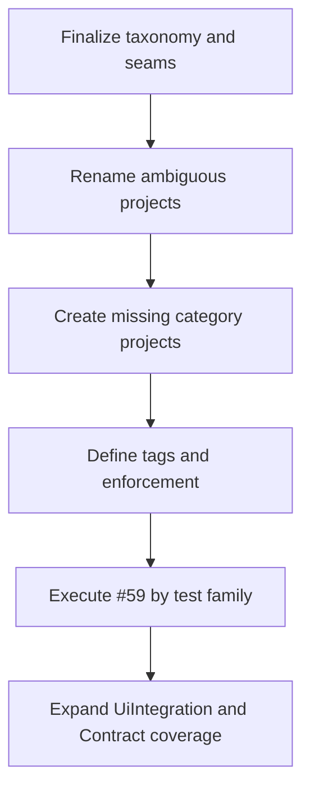

# Test Execution Model

## Purpose

This file captures the intended execution model for the repository test
taxonomy, the implementation order, and the supporting issue structure.

It is not the taxonomy source of truth. The permanent taxonomy and seam rules
live in:

- `tests/README.md`
- `docs/TEST_GUIDELINES.md`
- `tests/TEST_FIXTURE_SEAM.md`
- `tests/ASSEMBLY_FIXTURE_GUIDANCE.md`

This file exists to sequence the work.

## Canonical Test Families

The repository uses these stable test families:

- `UnitTests`
- `BehaviorTests`
- `WebTests`
- `UiIntegrationTests`
- `IntegrationTests`
- `SystemTests`
- `ContractTests`
- `ArchitectureTests`
- `performance/`

Execution intent stays orthogonal to project naming:

- `smoke`
- `regression`
- `load`
- `stress`
- `spike`
- `soak`
- snapshot style

## Guiding Rules

1. Define categories and seams before broad fixture refactors.
2. Rename ambiguous project names before adding more categories around them.
3. Create new projects only when a real category exists or is intentionally
   being established now.
4. Keep host technology out of permanent category names.
5. Apply per-family patterns intentionally instead of one generic test-host
   abstraction for everything.
6. Enforce the taxonomy with analyzers and tests once the taxonomy is stable.

## Issue Roles

| Issue | Role |
| --- | --- |
| `#115` | Canonical taxonomy, seams, entrypoints, and scope definitions |
| `#59` | Admin integration and system fixture seam implementation cleanup |
| `#116` | Drift guards so docs and architecture do not diverge again |
| `#137` | Phased category and host-model migration umbrella |

Missing focused issues that should be created next:

- [ ] contract test rollout
- [ ] test-tag governance and enforcement
- [ ] analyzers/code fixes for test naming and convention enforcement
- [ ] shared testing infrastructure split and ownership rules

## Priority Order

### Tier 1: establish the category frame

- [x] Finalize canonical taxonomy and seam docs.
- [x] Rename `ViajantesTurismo.Admin.E2ETests` to `ViajantesTurismo.Admin.SystemTests`.
- [x] Rename `ViajantesTurismo.Admin.Tests.Shared` to `ViajantesTurismo.Admin.Testing`.
- [x] Create the empty but valid category projects that are already decided:
    - `ViajantesTurismo.Admin.UiIntegrationTests`
    - `ViajantesTurismo.Admin.ContractTests`

Rationale:

- category clarity should come before deeper test migration
- stable names reduce churn in later fixture and analyzer work

### Tier 2: define enforcement and support patterns

- [x] Define the shared tagging model.
- [ ] Add analyzers or architecture tests to enforce required tags and naming.
- [ ] Decide whether generic testing support should stay in `Admin.Testing` or be
  split further with SharedKernel-backed support libraries.

Rationale:

- once names are stable, enforcement becomes worthwhile
- before that, analyzers would simply chase moving targets

### Tier 3: execute test-family migrations in parts

- [ ] Work `#59` in slices by test family, not as one large refactor.

Suggested order inside `#59`:

1. [ ] `ViajantesTurismo.Admin.IntegrationTests`
2. [ ] `ViajantesTurismo.Admin.SystemTests`
3. [ ] `ViajantesTurismo.Management.WebTests`
4. [ ] `ViajantesTurismo.Admin.UiIntegrationTests`
5. [ ] `ViajantesTurismo.Admin.ContractTests`

Rationale:

- API integration seams are usually easier to make explicit than browser/system
  seams
- system/browser tests benefit from the integration seam cleanup happening first
- UI integration should be shaped after the stack-specific web testing patterns
  are better understood

## Project-Creation Policy

### Create now

- [x] `ViajantesTurismo.Admin.UiIntegrationTests`
- [x] `ViajantesTurismo.Admin.ContractTests`

### Create later only if justified

- [ ] `ViajantesTurismo.Admin.Testing.Analyzers`
- [ ] `SharedKernel.Testing.Conventions`
- [ ] dedicated snapshot-specific project
- [ ] dedicated smoke-only project
- [ ] dedicated load-only project

### Keep as capability area, not project family

- `tests/performance/`
    - smoke
    - load
    - stress
    - spike
    - soak

## Analyzer and Governance Direction

Planned enforcement areas:

- [ ] required tags per test family
- [ ] naming conventions for test classes and methods
- [ ] no generic service-container reach-through in test bodies
- [ ] no broad host abstractions that violate the defined seams
- [ ] drift checks between canonical docs and actual project/category names

Preferred implementation style:

- start with architecture tests and lightweight guards
- move to analyzers/code fixes where static enforcement is stronger and less noisy
- use typed attributes only if they genuinely improve adoption more than plain
  traits plus analyzer enforcement

## Contract Test Direction

Contract tests are expected soon and intentionally have their own category.

They should focus on boundaries that matter independently of implementation,
such as:

- Admin API payload compatibility
- OpenAPI or schema compatibility
- future messaging boundaries if introduced

Snapshots may be used in this project, but snapshot testing remains a technique,
not a default top-level family.

## Diagram

## Success Conditions

- [x] project names match the canonical taxonomy where categories have already been established
- [x] missing categories exist where intentionally chosen
- [ ] `#59` is executed as a series of family-specific improvements
- [ ] enforcement exists for naming, tags, and seam boundaries
- [ ] future contributors can identify where a new test belongs without guessing
