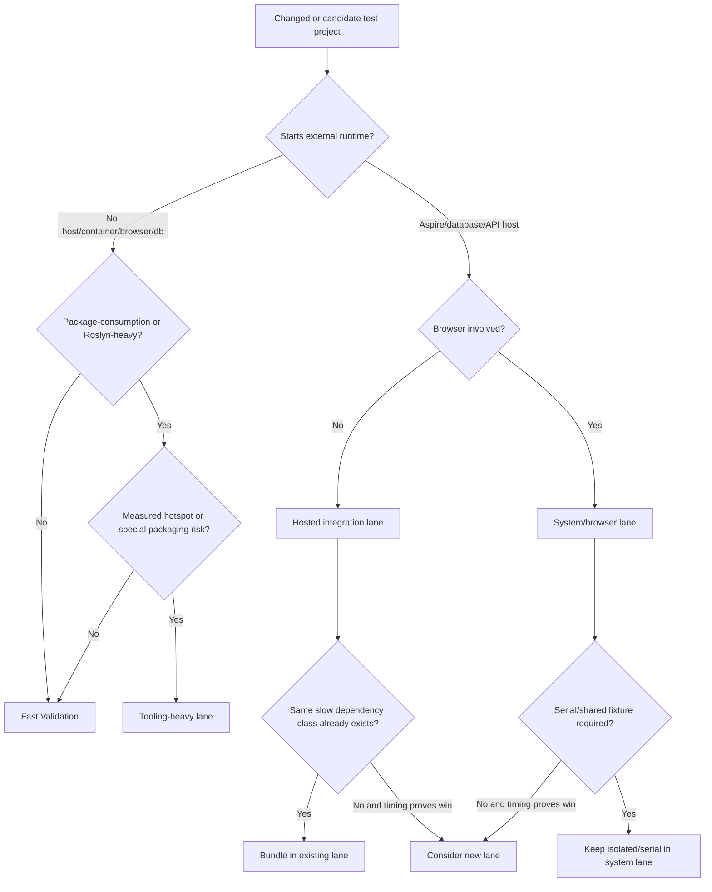

# ADR-030: CI Test Lane Selection

## Context

The repository has multiple test costs:

- no-host tests: unit, contract, component, behavior, architecture, analyzer, and generator tests
- package-consumption tests: tests that prove a produced package works in a consumer project
- hosted integration tests: tests that start Aspire, containers, databases, or app hosts
- system tests: Playwright tests against the running application

Issue #426 added `scripts/benchmark-local-validation.sh` so validation timing can be measured locally before CI changes. Issue #438 confirmed that a
solution-level no-build/no-restore test run is not a safe CI baseline on this repository: `dotnet test --solution ViajantesTurismo.slnx --no-restore
--no-build` failed locally after 131 seconds because hosted/system tests ran concurrently and interfered with shared AppHost, database, and browser state.

Splitting every slow test project into its own CI job is also not the default answer. Dependency-heavy tests pay fixed startup costs for restore, build,
AppHost, containers, databases, and browsers. More jobs only help when parallel wall-clock savings beat duplicated setup cost.

## Decision

CI test lanes are selected by runtime dependency and failure-isolation need, not by project count alone.

- `Fast Validation` must stay no-host and no-container. Small test count does not make a hosted test fast.
- Hosted/database/API tests are bundled before adding new CI jobs unless measured timing shows a split wins.
- Browser/system tests stay separate from API integration tests because they use a different entrypoint, failure mode, and concurrency model.
- Package-consumption tests move out of fast validation only when they are measured hotspots or protect packaging behavior that deserves separate failure
  visibility.
- The current `mediator-heavy` lane is a tooling-heavy lane in practice. It is mediator-specific today because that is the only package-consumption hotspot
  with a dedicated lane and required check. Do not add more package-consumption lanes without benchmark evidence.

## Consequences

### Positive

- Fast validation remains meaningful as a no-host feedback lane.
- CI avoids the false baseline of running all tests concurrently when hosted tests conflict.
- New lanes require evidence, not intuition.
- Local benchmark output can justify lane changes before CI is touched.

### Negative

- Some lane names remain historical, especially `admin-integration-tests` and `mediator-heavy-tests`.
- Bundling unrelated dependency-heavy projects can make one job longer even when it avoids another required check.
- A local benchmark can differ from CI because CI collects coverage and uses hosted runner images.

## Alternatives

### Run all tests in one solution-level command

Rejected. The local baseline failed after 131 seconds because system tests ran concurrently with other hosted tests and hit AppHost/database/browser
interference. A single solution-level command is a useful smoke experiment, not a reliable CI lane.

### Split every slow test project into its own CI job

Rejected. This duplicates fixed setup costs and creates more required checks. Use only when timing data proves wall-clock improvement.

### Keep every Roslyn, generator, code-fix, and package-consumption test in fast validation

Rejected as an absolute rule. Most no-host tooling tests can stay in fast validation, but measured package-consumption hotspots may need a tooling-heavy lane.

## Status

Accepted.

## Links

- [ADR Index](../ARCHITECTURE_DECISIONS.md)
- [CI main workflow](../ci/main-workflow.md)
- [Test guidelines](../TEST_GUIDELINES.md)
- [Code quality local validation runtime](../CODE_QUALITY.md#local-validation-runtime)
- [Issue #426](https://github.com/danigutsch/ViajantesTurismo/issues/426)
- [Issue #438](https://github.com/danigutsch/ViajantesTurismo/issues/438)
