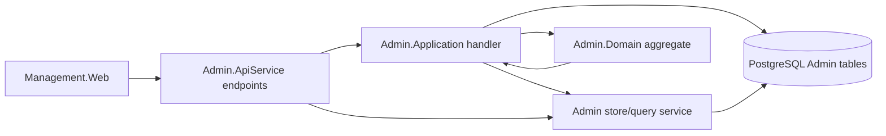
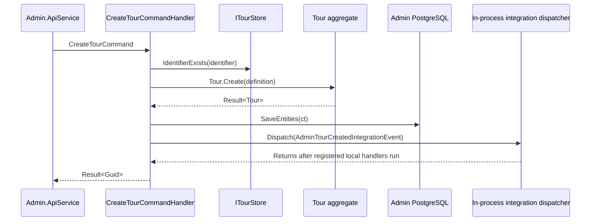
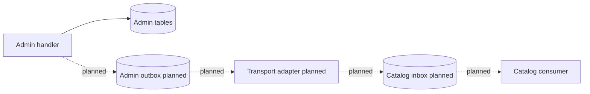
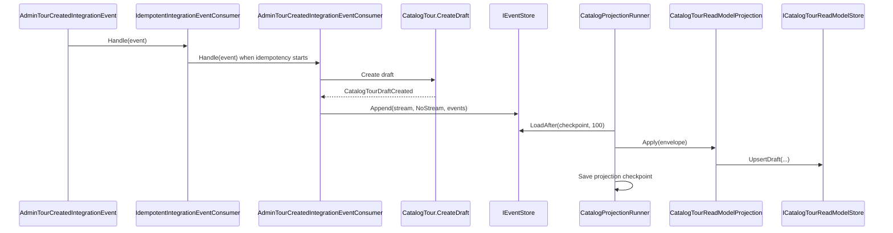
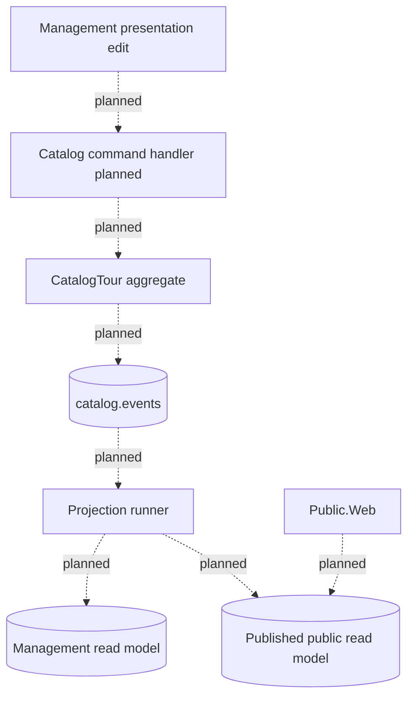
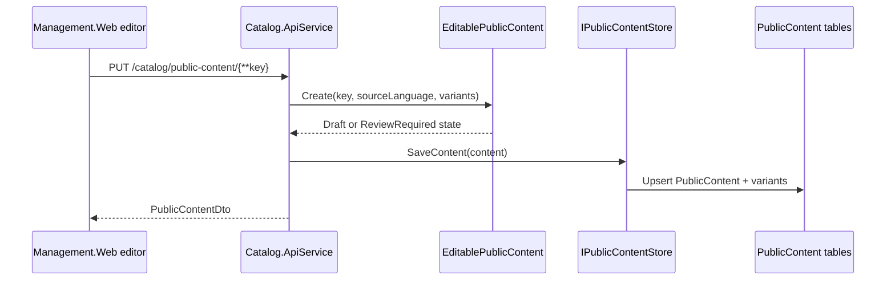
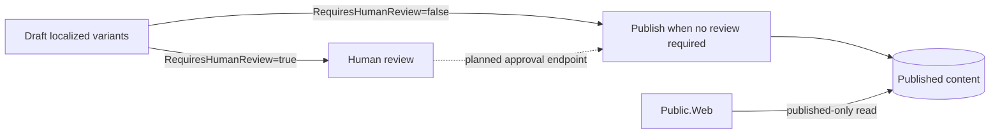
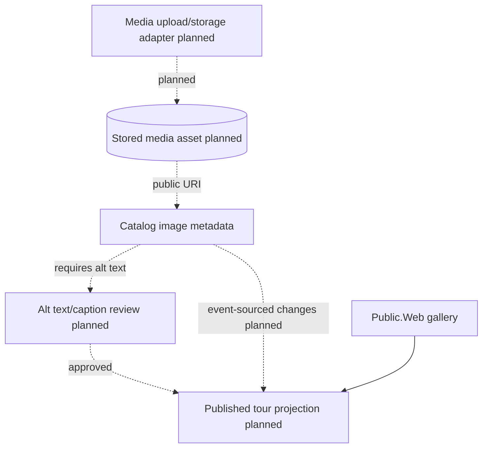

# Architecture Flows

These diagrams separate implemented behavior from planned/evolving behavior. They are source-controlled
Mermaid diagrams so they can be reviewed with the surrounding Markdown.

## Admin workflows

### Current implementation

Admin owns operational tour, customer, booking, and payment workflows. The API routes map to
application handlers, handlers enforce cross-aggregate checks through stores, domain aggregates enforce
invariants, and EF Core persists state through the Admin write database.



Implemented workflow groups:

- Tours: create, update, list, get by id.
- Customers: create, update, list, get by id, import preview/commit flow.
- Bookings: create, confirm, cancel, complete, delete pending bookings, update notes, update discount,
  update details, record payments, and query by tour/customer.
- Payments: recorded through the booking aggregate; payment status is calculated from payments and
  booking total.

Tour creation currently dispatches `AdminTourCreatedIntegrationEvent` after `SaveEntities(ct)` through
the in-process `ServiceProviderIntegrationEventDispatcher`.



### Planned/evolving

Durable Admin-to-Catalog publication is planned, not fully wired in the current runtime. The event and
messaging docs describe outbox/inbox direction; current Admin production code does not persist an
Admin outbox row or transport the event to Catalog.ApiService.



## Catalog event sourcing and projection flows

### Current implementation

Catalog has event-sourcing abstractions and tested application components for consuming
`AdminTourCreatedIntegrationEvent`, creating a `CatalogTourDraftCreated` event, and projecting it into
`CatalogTourReadModels`. The Catalog API currently exposes read-model CRUD-style endpoints for tour
presentation and public published tour reads.



Current runtime limits:

- `CatalogTour` currently applies `CatalogTourDraftCreated` only.
- `PUT /catalog/tours/{id}/presentation` updates the read model directly; it does not append a
  Catalog tour presentation event yet.
- Public endpoints read only rows marked `IsPublished` from the read model.
- Projection runner and integration consumer are application components with unit coverage; production
  DI wiring for event store, idempotency store, and background projection execution is still evolving.
- `CatalogTelemetry` emits OpenTelemetry activities and counters around integration event handling,
  idempotency decisions, tour stream updates, and projection batches.

### Planned/evolving

ADR-025 remains the direction for versioned Catalog tour presentation. Future slices should move
presentation edits and publication transitions behind event-sourced aggregate commands before treating
read models as rebuildable source-of-truth projections.



## Public content localization and review flows

### Current implementation

Catalog owns editable public content for `en-US` and `pt-BR` variants. The current API lets management
clients list, get, and upsert content entries. The domain marks entries as `ReviewRequired` when any
variant has `RequiresHumanReview`; `Publish()` blocks publication while review is required.



Current behavior:

- Supported variants are explicit: `en-US` and `pt-BR`.
- Both variants are required for each editable content entry.
- Machine-translated or AI-assisted content is represented by `RequiresHumanReview` on the variant.
- Public content tables persist entries and variants.
- Management-facing routes use `/catalog/public-content/{**key}` so stable content keys can contain
  path separators.
- Public reads use `GET /public/catalog/content/{**key}` and return published content only, selecting
  the requested approved language variant with fallback behavior.
- Upsert publishes immediately when no variant requires review; otherwise content remains
  review-required.

### Planned/evolving

Explicit review approval and manual publish endpoints are planned/evolving. Do not assume automatic
translation or auto-approval until those slices exist.



## Media, gallery, and image metadata flows

### Current implementation

Catalog owns customer-facing image metadata and tour associations. Binary storage remains outside the
Catalog aggregate; Catalog stores safe public URIs, alt text, captions, attribution, tags, ordering,
cover-image flags, processing status, and responsive variants.

```mermaid
flowchart LR
    management[Management.Web media editor]
    api[Catalog.ApiService]
    store[IPublicMediaImageStore]
    db[(PublicMediaImages tables)]
    mapper[MapTour]
    dto[CatalogTourDto.Images]
    publicWeb[Public.Web gallery]

    management --> api
    api -->|PUT /catalog/media/images/{id}| store
    store --> db
    api -->|GET /catalog/tours/{id}/images| store
    api --> mapper
    mapper --> dto
    publicWeb --> dto
```

Current constraints visible in contracts:

- `Uri` is required.
- `AltText` is required and length-limited for accessibility.
- `Caption` is optional and length-limited.
- Public tour endpoints filter images to `Ready` processing status.

### Planned/evolving

Future media work should move gallery metadata changes behind Catalog event-sourced commands if tour
presentation read models become rebuildable from event streams.



Open design points for future issues:

- Storage provider and upload policy.
- Image ordering, hero-image selection, and removal behavior.
- Whether image metadata changes are Catalog tour events or a separate media stream.
- Accessibility review requirements beyond required `AltText`.

## References

- [Architecture overview](README.md)
- [Catalog bounded context](../bounded-contexts/Catalog.md)
- [Events and messaging](../domain/EVENTS_AND_MESSAGING.md)
- [Aggregates](../domain/AGGREGATES.md)
- [Domain validation](../DOMAIN_VALIDATION.md)
- [ADR-020: Web Frontends by Audience, Not by Bounded Context](../adr/20260523-web-frontends-by-audience-not-by-bounded-context.md)
- [ADR-021: Catalog Bounded Context for Public Tour Presentation](../adr/20260621-catalog-bounded-context-for-public-tour-presentation.md)
- [ADR-025: Event Source Catalog Tour Presentation](../adr/20260621-event-source-catalog-tour-presentation.md)
