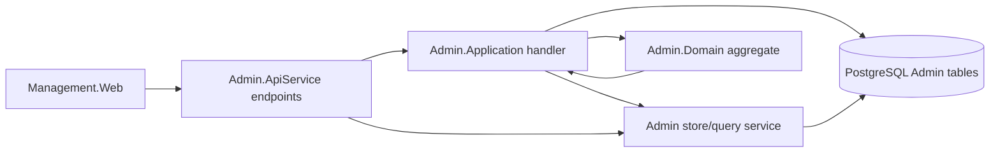
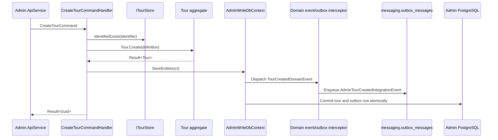
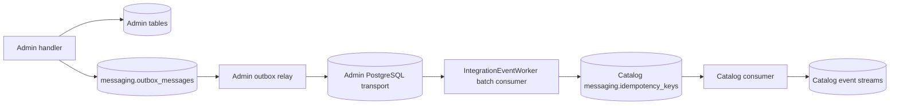
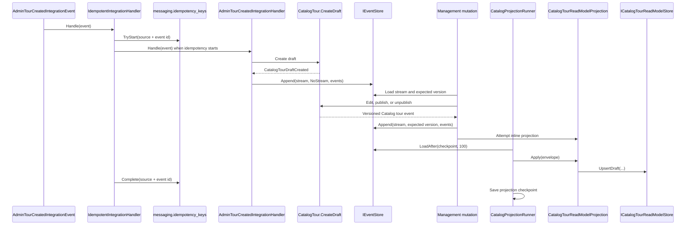
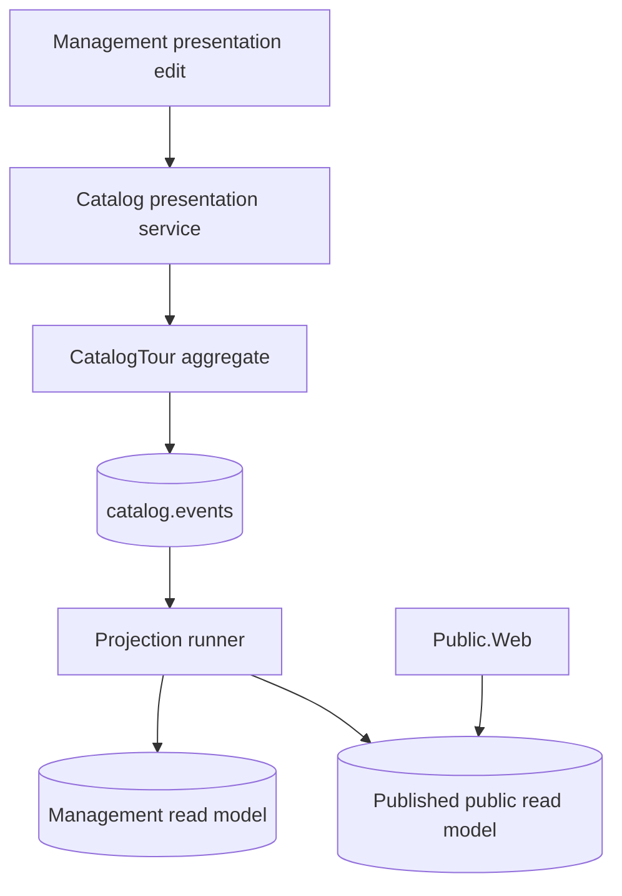
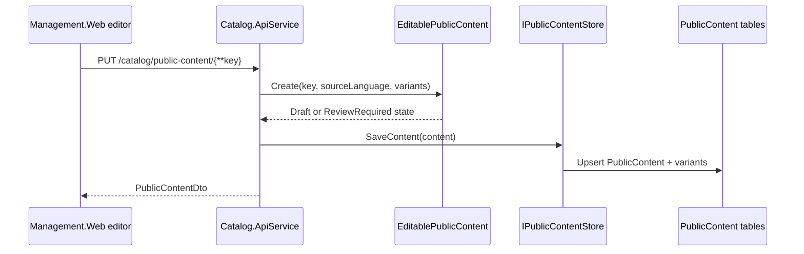
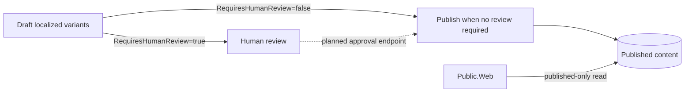
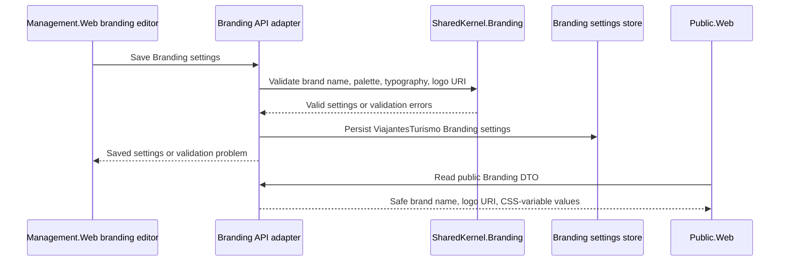
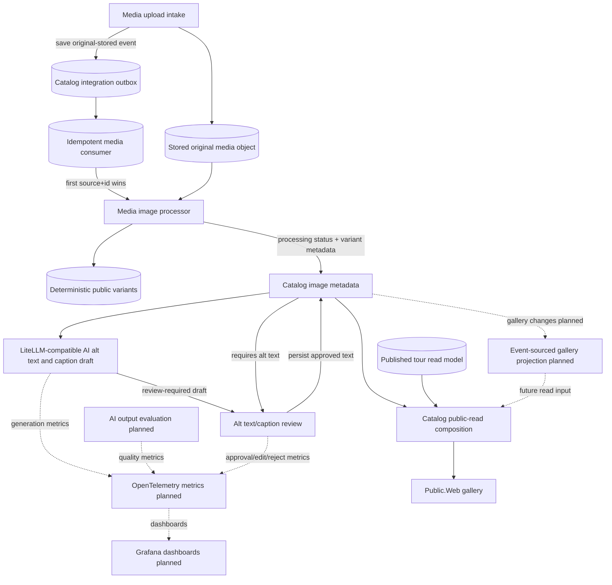

# Architecture Flows

These source-controlled Mermaid diagrams identify implemented behavior and explicitly mark only future
behavior as planned.

## Admin workflows

### Current implementation

Admin owns operational tour, customer, booking, and payment workflows. The API routes map to
application handlers, handlers enforce cross-aggregate checks through stores, domain aggregates enforce
invariants, and EF Core persists state through the Admin write database.

```mermaid
flowchart LR
    management[Management.Web]
    api[Admin.ApiService endpoints]
    handler[Admin.Application handler]
    store[Admin store/query service]
    domain[Admin.Domain aggregate]
    db[(PostgreSQL Admin tables)]

    management --> api
    api --> handler
    handler --> store
    handler --> domain
    domain --> handler
    handler --> db
    api --> store
    store --> db
```

Implemented workflow groups:

- Tours: create, update, list, get by id.
- Customers: create, update, list, get by id, import preview/commit flow.
- Bookings: create, confirm, cancel, complete, delete pending bookings, update notes, update discount,
  update details, record payments, and query by tour/customer.
- Payments: recorded through the booking aggregate; payment status is calculated from payments and
  booking total.

Tour creation uses a directly resolved scoped `CreateTourCommandHandler`. `SaveEntities(ct)` invokes the
EF Core domain-event interceptor; the generated exhaustive mapper enqueues
`AdminTourCreatedIntegrationEvent` in the transactional outbox before the same save commits.

Admin command handlers remain direct scoped services. They retain their explicit `SaveEntities(ct)`
pattern; stores may still use a local transaction when one persistence operation requires multiple
`SaveChanges` calls to remain atomic.

Each module owns one DbContext registration method that applies all module options inside the actual
provider registration callback. EF Core `ConfigureDbContext<TContext>()` can compose options for
`AddDbContextPool`, but pooled contexts still require registration-time configuration and the repo's
Aspire provider wrappers are clearer when the module owns the final callback. Domain-event
interception should live in a separate package over these EF Core primitives, not in
`SharedKernel.EntityFrameworkCore`.

```mermaid
sequenceDiagram
    participant API as Admin.ApiService
    participant Handler as CreateTourCommandHandler
    participant Store as ITourStore
    participant Tour as Tour aggregate
    participant Context as AdminWriteDbContext
    participant Interceptor as Domain event/outbox interceptor
    participant Outbox as messaging.outbox_messages
    participant Db as Admin PostgreSQL

    API->>Handler: CreateTourCommand
    Handler->>Store: IdentifierExists(identifier)
    Handler->>Tour: Tour.Create(definition)
    Tour-->>Handler: Result<Tour>
    Handler->>Context: SaveEntities(ct)
    Context->>Interceptor: Dispatch TourCreatedDomainEvent
    Interceptor->>Outbox: Enqueue AdminTourCreatedIntegrationEvent
    Context->>Db: Commit tour and outbox row atomically
    Handler-->>API: Result<Guid>
```

### Current durable boundary

Admin tour creation persists integration events through the EF Core outbox provider. Admin and Catalog
use separate databases, which may share one PostgreSQL server; each database owns its own `messaging`
schema. The Admin relay moves envelopes from `messaging.outbox_messages` into the Admin PostgreSQL
transport table. `IntegrationEventWorker` claims a batch with `FOR UPDATE SKIP LOCKED`, keeps one scope
for that batch, processes its messages sequentially, and records lease/retry state. The generated typed
publisher resolves the Catalog handler, whose idempotency wrapper writes Catalog
`messaging.idempotency_keys`.

<!-- doc-fact:admin-catalog-runtime:start -->
- current-runtime: `AddAdminRuntimeBackgroundServices`
- current-runtime: `AddCatalogHostedIntegrationEventTransport`
- current-runtime: `AddCatalogIntegrationEventTransportConsumer`
- current-runtime: `AddCatalogIntegrationEventTransportContext`
- current-runtime: `AddCatalogIntegrationEventWorkerInfrastructure`
- current-runtime: `AddIntegrationEventContract`
- current-runtime: `AddIntegrationEventOutbox`
- current-runtime: `AddIntegrationEventOutboxRelay`
- current-runtime: `AddPostgreSqlIntegrationEventOutboxRelayAtomicClaims`
- current-runtime: `AddPostgreSqlIntegrationEventTransportConsumer`
- current-runtime: `AddPostgreSqlIntegrationEventTransportProducer`
- current-runtime: `CatalogProjectionHostedService`
<!-- doc-fact:admin-catalog-runtime:end -->

```mermaid
flowchart LR
    adminHandler[Admin handler]
    adminDb[(Admin tables)]
    outbox[(messaging.outbox_messages)]
    relay[Admin outbox relay]
    transport[(Admin PostgreSQL transport)]
    worker[IntegrationEventWorker batch consumer]
    inbox[(Catalog messaging.idempotency_keys)]
    catalogConsumer[Catalog consumer]
    catalogEvents[(Catalog event streams)]

    adminHandler --> adminDb
    adminHandler --> outbox
    outbox --> relay
    relay --> transport
    transport --> worker
    worker --> inbox
    inbox --> catalogConsumer
    catalogConsumer --> catalogEvents
```

Admin write-side domain-event dispatch uses SaveChanges interception to write outbox rows in the same
transaction as aggregate changes. Domain events remain on aggregates when SaveChanges fails and are
cleared only after EF reports a successful save.

```mermaid
sequenceDiagram
    participant Handler as Admin command handler
    participant Aggregate as Aggregate
    participant Context as AdminWriteDbContext
    participant Interceptor as SaveChanges interceptor
    participant Dispatcher as Composite domain event dispatcher
    participant Mapper as Generated outbox mapper
    participant Audit as Generated audit handler
    participant Outbox as messaging.outbox_messages
    participant AuditRows as Admin audit records
    participant Db as Admin PostgreSQL

    Handler->>Aggregate: mutate; record domain event
    Handler->>Context: SaveEntities(ct)
    Context->>Interceptor: SavingChanges
    Interceptor->>Dispatcher: Dispatch(domain events)
    Dispatcher->>Mapper: Dispatch mapped domain events
    Mapper->>Outbox: Enqueue serialized integration events
    Dispatcher->>Audit: Dispatch auditable domain events
    Audit->>AuditRows: Add audit records
    Context->>Db: save aggregate rows + outbox rows
    alt save succeeds
        Db-->>Context: commit ok
        Context->>Interceptor: SavedChanges
        Interceptor->>Aggregate: ClearDomainEvents()
    else save fails
        Db-->>Context: rollback / savepoint rollback
        Context->>Interceptor: SaveChangesFailed
        Interceptor-->>Aggregate: leave domain events intact
    end
```

## Catalog event sourcing and projection flows

### Current implementation

Catalog consumes `AdminTourCreatedIntegrationEvent`, appends `CatalogTourDraftCreated`, and projects
the stream into `CatalogTourReadModels`. Management presentation edits and publish/unpublish actions
rehydrate the aggregate, append versioned events, and attempt inline projection. If the append commits
but projection is deferred, the API returns `202 Accepted`; the background projection runner retries
from the unchanged checkpoint.

<!-- doc-fact:catalog-tour-events:start -->
- current-event: `CatalogTourDraftCreated`
- current-event: `CatalogTourPresentationChanged`
- current-event: `CatalogTourPublished`
- current-event: `CatalogTourUnpublished`
<!-- doc-fact:catalog-tour-events:end -->

```mermaid
sequenceDiagram
    participant Event as AdminTourCreatedIntegrationEvent
    participant Idem as IdempotentIntegrationHandler
    participant Keys as messaging.idempotency_keys
    participant Handler as AdminTourCreatedIntegrationHandler
    participant Aggregate as CatalogTour.CreateDraft
    participant Store as IEventStore
    participant Management as Management mutation
    participant Runner as CatalogProjectionRunner
    participant Projection as CatalogTourReadModelProjection
    participant ReadModel as ICatalogTourReadModelStore

    Event->>Idem: Handle(event)
    Idem->>Keys: TryStart(source + event id)
    Idem->>Handler: Handle(event) when idempotency starts
    Handler->>Aggregate: Create draft
    Aggregate-->>Handler: CatalogTourDraftCreated
    Handler->>Store: Append(stream, NoStream, events)
    Management->>Store: Load stream and expected version
    Management->>Aggregate: Edit, publish, or unpublish
    Aggregate-->>Management: Versioned Catalog tour event
    Management->>Store: Append(stream, expected version, events)
    Management->>Projection: Attempt inline projection
    Runner->>Store: LoadAfter(checkpoint, 100)
    Runner->>Projection: Apply(envelope)
    Projection->>ReadModel: UpsertDraft(...)
    Idem->>Keys: Complete(source + event id)
    Runner->>Runner: Save projection checkpoint
```

Current runtime behavior:

- `CatalogTour` applies draft creation, presentation change, publish, and unpublish events.
- Management presentation and publication mutations append to the tour stream with optimistic
  expected-version checks.
- Public endpoints read only rows marked `IsPublished` from the read model.
- `IntegrationEventWorker` hosts PostgreSQL transport consumption, background projection execution,
  and media reconciliation. A claimed transport batch shares one DI scope and is processed sequentially.
- A committed mutation with deferred projection returns `202 Accepted` and a management-detail
  `Location`; background projection retries it.
- `CatalogTelemetry` emits OpenTelemetry activities and counters around integration event handling,
  idempotency decisions, tour stream updates, and projection batches.

### Remaining evolution

Tour presentation and publication read models are rebuildable from Catalog tour streams. Tour gallery
associations and ordering still use media metadata outside those streams; a future event-sourced gallery
transition is required before claiming the complete visual presentation is stream-rebuildable.

```mermaid
flowchart TB
    edit[Management presentation edit]
    command[Catalog presentation service]
    aggregate[CatalogTour aggregate]
    events[(catalog.events)]
    projector[Projection runner]
    managementRead[(Management read model)]
    publicRead[(Published public read model)]
    publicWeb[Public.Web]

    edit --> command
    command --> aggregate
    aggregate --> events
    events --> projector
    projector --> managementRead
    projector --> publicRead
    publicWeb --> publicRead
```

## Public content localization and review flows

### Current implementation

Catalog owns editable public content for `en-US` and `pt-BR` variants. The current API lets management
clients list, get, and upsert content entries. The domain marks entries as `ReviewRequired` when any
variant has `RequiresHumanReview`; `Publish()` blocks publication while review is required.

```mermaid
sequenceDiagram
    participant Editor as Management.Web editor
    participant API as Catalog.ApiService
    participant Content as EditablePublicContent
    participant Store as IPublicContentStore
    participant Db as PublicContent tables

    Editor->>API: PUT /catalog/public-content/{**key}
    API->>Content: Create(key, sourceLanguage, variants)
    Content-->>API: Draft or ReviewRequired state
    API->>Store: SaveContent(content)
    Store->>Db: Upsert PublicContent + variants
    API-->>Editor: PublicContentDto
```

Current behavior:

- Supported variants are explicit: `en-US` and `pt-BR`.
- Both variants are required for each editable content entry.
- Machine-translated or AI-assisted content is represented by `RequiresHumanReview` on the variant.
- Public content tables persist entries and variants.
- Management-facing routes use `/catalog/public-content/{**key}` so stable content keys can contain
  path separators.
- Public reads use `GET /public/catalog/content/{**key}` and return published content only, selecting
  the requested approved language variant with fallback behavior.
- Upsert publishes immediately when no variant requires review; otherwise content remains
  review-required.

### Planned/evolving

Explicit review approval and manual publish endpoints are planned/evolving. Do not assume automatic
translation or auto-approval until those slices exist.

```mermaid
flowchart LR
    draft[Draft localized variants]
    review[Human review]
    publish[Publish when no review required]
    published[(Published content)]
    publicWeb[Public.Web]

    draft -->|RequiresHumanReview=true| review
    draft -->|RequiresHumanReview=false| publish
    review -. planned approval endpoint .-> publish
    publish --> published
    publicWeb -->|published-only read| published
```

## Branding settings rendering flow

Branding uses reusable validation and public-safe contracts from `SharedKernel.Branding`. The
ViajantesTurismo Branding API adapter owns app-specific persistence, API routes, default values, and
cache invalidation. It keeps a separate `BrandingDbContext` while storing its tables in the existing
Catalog physical database.

```mermaid
sequenceDiagram
    participant Editor as Management.Web branding editor
    participant API as Branding API adapter
    participant Core as SharedKernel.Branding
    participant Store as Branding settings store
    participant Public as Public.Web

    Editor->>API: Save Branding settings
    API->>Core: Validate brand name, palette, typography, logo URI
    Core-->>API: Valid settings or validation errors
    API->>Store: Persist ViajantesTurismo Branding settings
    API-->>Editor: Saved settings or validation problem
    Public->>API: Read public Branding DTO
    API-->>Public: Safe brand name, logo URI, CSS-variable values
```

Current rendering rules:

- `SharedKernel.Branding` owns base identity tokens only: brand name, logo URI, palette, and typography.
- Management.Web uses the tokens as functional editable configuration; Public.Web uses them for richer
  customer-facing presentation.
- No arbitrary user-editable CSS is accepted. Editors choose constrained values; Public.Web renders
  fixed CSS custom-property names with validated values.
- Preview, review, scheduled publish, and approval workflows are deferred until implemented.

## Media, gallery, and image metadata flows

### Current implementation

Catalog owns customer-facing image metadata and tour associations. Binary storage remains outside the
Catalog aggregate; Catalog stores object keys internally alongside reviewed alt text or explicit
decorative-image decisions, captions, localized accessibility review state, attribution, tags, ordering,
cover-image flags, processing status, and responsive variants. Public contracts expose only image IDs and
rendition metadata.

```mermaid
flowchart LR
    management[Management.Web media editor]
    api[Catalog.ApiService]
    store[IPublicMediaImageStore]
    db[(PublicMediaImages tables)]
    mapper[MapTour]
    dto[CatalogTourDto.Images]
    publicWeb[Public.Web gallery]

    management --> api
    api -->|POST /catalog/tours/{id}/images| store
    store --> db
    api -->|GET /catalog/tours/{id}/images| store
    api --> mapper
    mapper --> dto
    publicWeb --> dto
```

Current constraints visible in contracts:

- Public image contracts contain image IDs and rendition dimensions/types, never storage keys or storage
  URIs.
- Public images require reviewed default accessibility text: non-empty `AltText` or an explicit
  decorative-image decision.
- `Caption` is optional and length-limited.
- AI-assisted accessibility drafts are generated through a SharedKernel LiteLLM-compatible adapter and
  are review-required by default.
- Public tour endpoints filter images to `Ready` processing status and reviewed accessibility text.
- Media object reconciliation scans deterministic `media/` object keys, reports missing references and
  orphaned objects, applies a grace period for in-flight work, and retries deletion failures on later runs.

### Current asynchronous processing

Upload intake validates, scans, probes, and stores the original object before atomically persisting media
metadata with `MediaImageOriginalStoredIntegrationEvent` in the Catalog outbox. The Catalog API outbox
relay dispatches the event to an idempotent in-process consumer. Processing creates deterministic thumbnail,
icon, AVIF, WebP, and JPEG variants keyed by media id, processing version, variant name, and format, then
records ready/failed status and responsive metadata. Reconciliation reports missing references and
orphaned objects.

```mermaid
flowchart TB
    upload[Media upload intake]
    asset[(Stored original media object)]
    outbox[(Catalog integration outbox)]
    inbox[(Idempotent media consumer)]
    processor[Media image processor]
    variants[(Deterministic public variants)]
    metadata[Catalog image metadata]
    ai[LiteLLM-compatible AI alt text and caption draft]
    eval[AI output evaluation planned]
    telemetry[OpenTelemetry metrics planned]
    grafana[Grafana dashboards planned]
    review[Alt text/caption review]
    tourRead[(Published tour read model)]
    publicRead[Catalog public-read composition]
    galleryProjection[Event-sourced gallery projection planned]
    publicWeb[Public.Web gallery]

    upload --> asset
    upload -->|save original-stored event| outbox
    outbox --> inbox
    inbox -->|first source+id wins| processor
    asset --> processor
    processor --> variants
    processor -->|processing status + variant metadata| metadata
    metadata --> ai
    ai -->|review-required draft| review
    ai -. generation metrics .-> telemetry
    eval -. quality metrics .-> telemetry
    review -. approval/edit/reject metrics .-> telemetry
    telemetry -. dashboards .-> grafana
    metadata -->|requires alt text| review
    review -->|persist approved text| metadata
    metadata --> publicRead
    tourRead --> publicRead
    metadata -. gallery changes planned .-> galleryProjection
    galleryProjection -. future read input .-> publicRead
    publicRead --> publicWeb
```

Remaining design points:

- Whether gallery metadata changes become Catalog tour events or a separate media stream.
- Evaluation rubric and golden fixture shape for AI-generated accessibility text.
- Grafana dashboard panels for generation quality, review outcomes, and publication blockers.
- Policy for optional geolocation context and future storage adapters.

## References

- [Architecture overview](README.md)
- [Catalog bounded context](../bounded-contexts/Catalog.md)
- [Events and messaging](../domain/EVENTS_AND_MESSAGING.md)
- [Aggregates](../domain/AGGREGATES.md)
- [Domain validation](../DOMAIN_VALIDATION.md)
- [ADR-020: Web Frontends by Audience, Not by Bounded Context](../adr/20260523-web-frontends-by-audience-not-by-bounded-context.md)
- [ADR-021: Catalog Bounded Context for Public Tour Presentation](../adr/20260621-catalog-bounded-context-for-public-tour-presentation.md)
- [ADR-025: Event Source Catalog Tour Presentation](../adr/20260621-event-source-catalog-tour-presentation.md)
