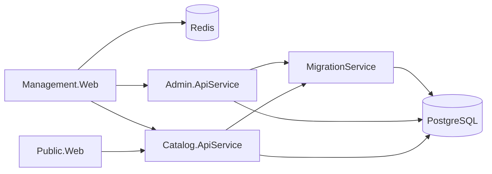
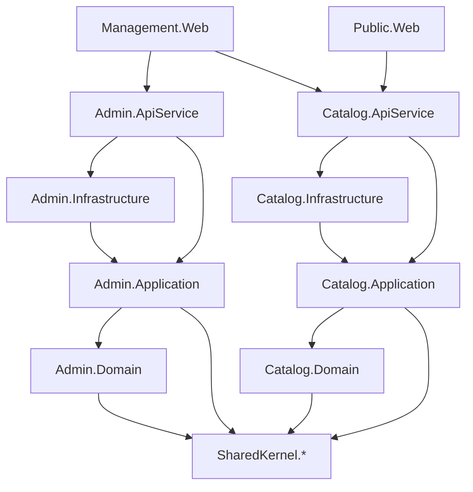
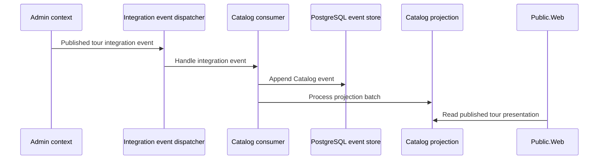

# Architecture Overview

This page links the current implementation shape to the longer-lived ADR and domain docs. Diagrams
show current repository structure unless a section is explicitly marked as planned. Generated
diagram sections are refreshed with `bash scripts/update-architecture-diagrams.sh`.

## Current runtime resources

The Aspire AppHost is the source of truth for local runtime wiring.

Source: `src/ViajantesTurismo.AppHost/AppHost.cs`.

For deployment mapping, service discovery, migration startup, and secret boundaries, see
[Runtime wiring and deployment mapping](runtime-wiring-and-deployment.md).

## Current project boundary map

Keep business rules in domain projects. Keep provider-specific persistence and external adapters in
bounded-context infrastructure unless ADR-027's split threshold justifies a reusable
`SharedKernel.<Capability>.<Provider>` adapter package.

For bounded-context ownership, SharedKernel modules, and allowed or forbidden dependency directions,
see [Architecture boundaries and dependency flow](boundaries-and-dependencies.md).

## Admin-to-Catalog content workflow

See [Architecture flows](FLOWS.md) for Admin workflows, Catalog event-sourcing/projection flows,
localized public-content review flows, and media/gallery metadata flows. Those diagrams separate
current implementation from planned/evolving work.

### Planned Admin-to-Catalog publication direction

The diagram above is the intended durable flow. Current production runtime has typed event and Catalog
consumer/projection components, but the durable outbox/transport/inbox path is still evolving. See
[Events and messaging](../domain/EVENTS_AND_MESSAGING.md) and Catalog ADRs in
[Architecture decisions](../ARCHITECTURE_DECISIONS.md#architecture--layers).

## Domain references

- [Admin bounded context](../bounded-contexts/Admin.md)
- [Catalog bounded context](../bounded-contexts/Catalog.md)
- [Architecture flows](FLOWS.md)
- [Domain aggregates](../domain/AGGREGATES.md)
- [Glossary](../domain/GLOSSARY.md)

## Flow references

- [Architecture boundaries and dependency flow](boundaries-and-dependencies.md)
- [Runtime wiring and deployment mapping](runtime-wiring-and-deployment.md)
- [CI and local validation flow](ci-validation-flows.md)
- [Observability signal and dashboard consumption flows](observability-consumption-flows.md)

## Current public content status

- Core public website content variants and localization are implemented through Catalog-owned content
  contracts and Public.Web rendering, separate from core Admin CRUD.
- Configurable public website theme settings are implemented separately from page text content and
  rendered by Public.Web through safe SSR-friendly CSS variables.
- Media/gallery management is planned under public-web media issues.
- Adapter package splits should follow ADR-027's capability-first naming, dependency-direction, and
  split-threshold rules.
