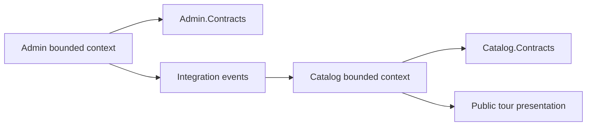
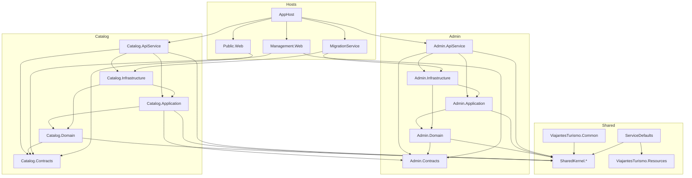
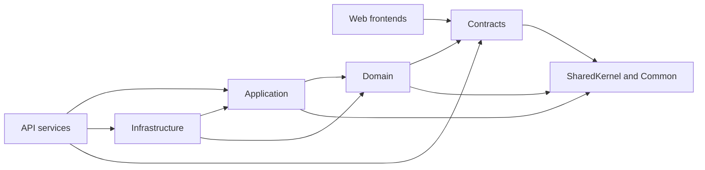
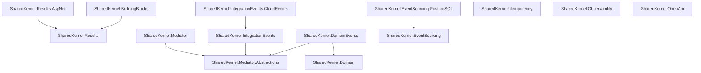

# Architecture boundaries and dependency flow

This page documents the current source-controlled dependency shape. Planned changes are listed
separately so diagrams can stay useful as repository structure evolves.

## Current bounded-context ownership

Admin owns booking and management workflows. Catalog owns public tour presentation. Admin publishes
integration events; Catalog consumes them and builds public read models.

Boundary rules:

- Admin business rules stay in `src/ViajantesTurismo.Admin.Domain`.
- Catalog presentation rules stay in `src/ViajantesTurismo.Catalog.Domain`.
- Cross-context interaction uses contracts and integration events, not direct domain references.
- Public web reads Catalog contracts; it does not reference Admin projects.

Related docs: [Admin bounded context](../bounded-contexts/Admin.md),
[Catalog bounded context](../bounded-contexts/Catalog.md), and
[events and messaging](../domain/EVENTS_AND_MESSAGING.md).

## Current project dependency map

## Allowed and forbidden dependency directions

Forbidden directions:

- Domain must not reference API, infrastructure, web, AppHost, or migration projects.
- Application must not depend on API, web, AppHost, or migration projects.
- Infrastructure must not depend on API or web projects.
- Web frontends must not reference domain or infrastructure projects directly.
- Catalog must not call Admin domain or infrastructure code directly.
- SharedKernel modules must not depend on bounded-context projects.

## Current SharedKernel module map

Module rules:

- Put reusable domain primitives in `SharedKernel.Domain` or `SharedKernel.BuildingBlocks`.
- Put reusable contracts for dispatching in mediator or integration-event modules.
- Put provider-specific persistence in provider modules such as
  `SharedKernel.EventSourcing.PostgreSQL`.
- Keep analyzers, source generators, and code fixes in their current tool-specific modules.

Related decisions:

- [split SharedKernel domain and building blocks](../adr/20260621-split-sharedkernel-domain-and-building-blocks.md)
- provider-specific SharedKernel infrastructure modules in
  [Architecture decisions](../ARCHITECTURE_DECISIONS.md#architecture--layers)
- domain materialization and persistence boundaries in
  [Architecture decisions](../ARCHITECTURE_DECISIONS.md#architecture--layers)

## Planned improvements

- Add automated dependency-direction checks only after the stable rules above are accepted.
- Split new SharedKernel provider packages only when at least two real callers need the capability.
- Keep future diagrams in Mermaid Markdown unless a different source-controlled diagram format is
  already required by the owning docs.
