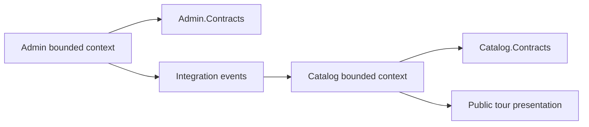
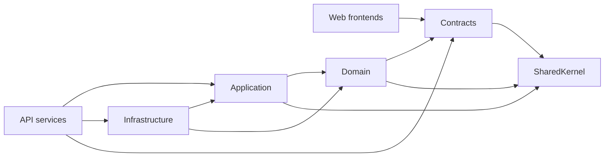

# Architecture boundaries and dependency flow

This page documents the current source-controlled dependency shape. Planned changes are listed
separately so diagrams can stay useful as repository structure evolves.

## Current bounded-context ownership

Admin owns booking and management workflows. Catalog owns public tour presentation. Admin publishes
integration events; Catalog consumes them and builds public read models.

```mermaid
flowchart LR
    admin[Admin bounded context]
    adminContracts[Admin.Contracts]
    integration[Integration events]
    catalog[Catalog bounded context]
    catalogContracts[Catalog.Contracts]
    publicRead[Public tour presentation]

    admin --> adminContracts
    admin --> integration
    integration --> catalog
    catalog --> catalogContracts
    catalog --> publicRead
```

Boundary rules:

- Admin business rules stay in `src/ViajantesTurismo.Admin.Domain`.
- Catalog presentation rules stay in `src/ViajantesTurismo.Catalog.Domain`.
- Cross-context interaction uses contracts and integration events, not direct domain references.
- Public web reads Catalog contracts; it does not reference Admin projects.

Related docs: [Admin bounded context](../bounded-contexts/Admin.md),
[Catalog bounded context](../bounded-contexts/Catalog.md), and
[events and messaging](../domain/EVENTS_AND_MESSAGING.md).

## Current project dependency map

This diagram is generated from source project references.

<!-- generated:project-dependencies:start -->
<!-- Generated by scripts/update-architecture-diagrams.py. Do not edit by hand. -->

```mermaid
flowchart TB
    ViajantesTurismo_Admin_ApiService[ViajantesTurismo.Admin.ApiService] --> SharedKernel_OpenApi[SharedKernel.OpenApi]
    ViajantesTurismo_Admin_ApiService[ViajantesTurismo.Admin.ApiService] --> SharedKernel_Results[SharedKernel.Results]
    ViajantesTurismo_Admin_ApiService[ViajantesTurismo.Admin.ApiService] --> SharedKernel_Results_AspNet[SharedKernel.Results.AspNet]
    ViajantesTurismo_Admin_ApiService[ViajantesTurismo.Admin.ApiService] --> ViajantesTurismo_Admin_Application[ViajantesTurismo.Admin.Application]
    ViajantesTurismo_Admin_ApiService[ViajantesTurismo.Admin.ApiService] --> ViajantesTurismo_Admin_Contracts[ViajantesTurismo.Admin.Contracts]
    ViajantesTurismo_Admin_ApiService[ViajantesTurismo.Admin.ApiService] --> ViajantesTurismo_Admin_Infrastructure[ViajantesTurismo.Admin.Infrastructure]
    ViajantesTurismo_Admin_ApiService[ViajantesTurismo.Admin.ApiService] --> ViajantesTurismo_ServiceDefaults[ViajantesTurismo.ServiceDefaults]
    ViajantesTurismo_Admin_Application[ViajantesTurismo.Admin.Application] --> SharedKernel_BuildingBlocks[SharedKernel.BuildingBlocks]
    ViajantesTurismo_Admin_Application[ViajantesTurismo.Admin.Application] --> SharedKernel_DomainEvents[SharedKernel.DomainEvents]
    ViajantesTurismo_Admin_Application[ViajantesTurismo.Admin.Application] --> SharedKernel_InputNormalization[SharedKernel.InputNormalization]
    ViajantesTurismo_Admin_Application[ViajantesTurismo.Admin.Application] --> SharedKernel_Mediator_Abstractions[SharedKernel.Mediator.Abstractions]
    ViajantesTurismo_Admin_Application[ViajantesTurismo.Admin.Application] --> SharedKernel_Messaging_IntegrationEvents[SharedKernel.Messaging.IntegrationEvents]
    ViajantesTurismo_Admin_Application[ViajantesTurismo.Admin.Application] --> SharedKernel_Messaging_IntegrationEvents_SourceGenerator[SharedKernel.Messaging.IntegrationEvents.SourceGenerator]
    ViajantesTurismo_Admin_Application[ViajantesTurismo.Admin.Application] --> SharedKernel_Results[SharedKernel.Results]
    ViajantesTurismo_Admin_Application[ViajantesTurismo.Admin.Application] --> SharedKernel_Results_SourceGenerator[SharedKernel.Results.SourceGenerator]
    ViajantesTurismo_Admin_Application[ViajantesTurismo.Admin.Application] --> ViajantesTurismo_Admin_Domain[ViajantesTurismo.Admin.Domain]
    ViajantesTurismo_Admin_Contracts[ViajantesTurismo.Admin.Contracts] --> SharedKernel_HttpClients[SharedKernel.HttpClients]
    ViajantesTurismo_Admin_Contracts[ViajantesTurismo.Admin.Contracts] --> SharedKernel_Mediator_Abstractions[SharedKernel.Mediator.Abstractions]
    ViajantesTurismo_Admin_Contracts[ViajantesTurismo.Admin.Contracts] --> SharedKernel_Messaging_IntegrationEvents[SharedKernel.Messaging.IntegrationEvents]
    ViajantesTurismo_Admin_Domain[ViajantesTurismo.Admin.Domain] --> SharedKernel_BuildingBlocks[SharedKernel.BuildingBlocks]
    ViajantesTurismo_Admin_Domain[ViajantesTurismo.Admin.Domain] --> SharedKernel_Domain[SharedKernel.Domain]
    ViajantesTurismo_Admin_Domain[ViajantesTurismo.Admin.Domain] --> SharedKernel_Domain_SourceGenerator[SharedKernel.Domain.SourceGenerator]
    ViajantesTurismo_Admin_Domain[ViajantesTurismo.Admin.Domain] --> SharedKernel_InputNormalization[SharedKernel.InputNormalization]
    ViajantesTurismo_Admin_Domain[ViajantesTurismo.Admin.Domain] --> SharedKernel_Results[SharedKernel.Results]
    ViajantesTurismo_Admin_Domain[ViajantesTurismo.Admin.Domain] --> SharedKernel_Results_SourceGenerator[SharedKernel.Results.SourceGenerator]
    ViajantesTurismo_Admin_Domain[ViajantesTurismo.Admin.Domain] --> ViajantesTurismo_Admin_Contracts[ViajantesTurismo.Admin.Contracts]
    ViajantesTurismo_Admin_Infrastructure[ViajantesTurismo.Admin.Infrastructure] --> SharedKernel_DomainEvents[SharedKernel.DomainEvents]
    ViajantesTurismo_Admin_Infrastructure[ViajantesTurismo.Admin.Infrastructure] --> SharedKernel_DomainEvents_EntityFrameworkCore[SharedKernel.DomainEvents.EntityFrameworkCore]
    ViajantesTurismo_Admin_Infrastructure[ViajantesTurismo.Admin.Infrastructure] --> SharedKernel_EntityFrameworkCore[SharedKernel.EntityFrameworkCore]
    ViajantesTurismo_Admin_Infrastructure[ViajantesTurismo.Admin.Infrastructure] --> SharedKernel_Mediator_EntityFrameworkCore[SharedKernel.Mediator.EntityFrameworkCore]
    ViajantesTurismo_Admin_Infrastructure[ViajantesTurismo.Admin.Infrastructure] --> SharedKernel_Messaging_IntegrationEvents[SharedKernel.Messaging.IntegrationEvents]
    ViajantesTurismo_Admin_Infrastructure[ViajantesTurismo.Admin.Infrastructure] --> SharedKernel_Messaging_IntegrationEvents_EntityFrameworkCore[SharedKernel.Messaging.IntegrationEvents.EntityFrameworkCore]
    ViajantesTurismo_Admin_Infrastructure[ViajantesTurismo.Admin.Infrastructure] --> ViajantesTurismo_Admin_Application[ViajantesTurismo.Admin.Application]
    ViajantesTurismo_Admin_Infrastructure[ViajantesTurismo.Admin.Infrastructure] --> ViajantesTurismo_Admin_Domain[ViajantesTurismo.Admin.Domain]
    ViajantesTurismo_Admin_Infrastructure[ViajantesTurismo.Admin.Infrastructure] --> ViajantesTurismo_Resources[ViajantesTurismo.Resources]
    ViajantesTurismo_AppHost[ViajantesTurismo.AppHost] --> SharedKernel_Aspire_Analyzers[SharedKernel.Aspire.Analyzers]
    ViajantesTurismo_AppHost[ViajantesTurismo.AppHost] --> SharedKernel_Aspire_Hosting_Grafana[SharedKernel.Aspire.Hosting.Grafana]
    ViajantesTurismo_AppHost[ViajantesTurismo.AppHost] --> ViajantesTurismo_Admin_ApiService[ViajantesTurismo.Admin.ApiService]
    ViajantesTurismo_AppHost[ViajantesTurismo.AppHost] --> ViajantesTurismo_Catalog_ApiService[ViajantesTurismo.Catalog.ApiService]
    ViajantesTurismo_AppHost[ViajantesTurismo.AppHost] --> ViajantesTurismo_IntegrationEventWorker[ViajantesTurismo.IntegrationEventWorker]
    ViajantesTurismo_AppHost[ViajantesTurismo.AppHost] --> ViajantesTurismo_Management_Web[ViajantesTurismo.Management.Web]
    ViajantesTurismo_AppHost[ViajantesTurismo.AppHost] --> ViajantesTurismo_MigrationService[ViajantesTurismo.MigrationService]
    ViajantesTurismo_AppHost[ViajantesTurismo.AppHost] --> ViajantesTurismo_Public_Web[ViajantesTurismo.Public.Web]
    ViajantesTurismo_AppHost[ViajantesTurismo.AppHost] --> ViajantesTurismo_Resources[ViajantesTurismo.Resources]
    ViajantesTurismo_Catalog_ApiService[ViajantesTurismo.Catalog.ApiService] --> SharedKernel_OpenApi[SharedKernel.OpenApi]
    ViajantesTurismo_Catalog_ApiService[ViajantesTurismo.Catalog.ApiService] --> ViajantesTurismo_Catalog_Application[ViajantesTurismo.Catalog.Application]
    ViajantesTurismo_Catalog_ApiService[ViajantesTurismo.Catalog.ApiService] --> ViajantesTurismo_Catalog_Contracts[ViajantesTurismo.Catalog.Contracts]
    ViajantesTurismo_Catalog_ApiService[ViajantesTurismo.Catalog.ApiService] --> ViajantesTurismo_Catalog_Infrastructure[ViajantesTurismo.Catalog.Infrastructure]
    ViajantesTurismo_Catalog_ApiService[ViajantesTurismo.Catalog.ApiService] --> ViajantesTurismo_ServiceDefaults[ViajantesTurismo.ServiceDefaults]
    ViajantesTurismo_Catalog_Application[ViajantesTurismo.Catalog.Application] --> SharedKernel_BuildingBlocks[SharedKernel.BuildingBlocks]
    ViajantesTurismo_Catalog_Application[ViajantesTurismo.Catalog.Application] --> SharedKernel_EventSourcing[SharedKernel.EventSourcing]
    ViajantesTurismo_Catalog_Application[ViajantesTurismo.Catalog.Application] --> SharedKernel_Idempotency[SharedKernel.Idempotency]
    ViajantesTurismo_Catalog_Application[ViajantesTurismo.Catalog.Application] --> SharedKernel_ImageProcessing[SharedKernel.ImageProcessing]
    ViajantesTurismo_Catalog_Application[ViajantesTurismo.Catalog.Application] --> SharedKernel_InputNormalization[SharedKernel.InputNormalization]
    ViajantesTurismo_Catalog_Application[ViajantesTurismo.Catalog.Application] --> SharedKernel_Mediator_Abstractions[SharedKernel.Mediator.Abstractions]
    ViajantesTurismo_Catalog_Application[ViajantesTurismo.Catalog.Application] --> SharedKernel_Messaging[SharedKernel.Messaging]
    ViajantesTurismo_Catalog_Application[ViajantesTurismo.Catalog.Application] --> SharedKernel_Messaging_IntegrationEvents[SharedKernel.Messaging.IntegrationEvents]
    ViajantesTurismo_Catalog_Application[ViajantesTurismo.Catalog.Application] --> SharedKernel_Results[SharedKernel.Results]
    ViajantesTurismo_Catalog_Application[ViajantesTurismo.Catalog.Application] --> ViajantesTurismo_Admin_Contracts[ViajantesTurismo.Admin.Contracts]
    ViajantesTurismo_Catalog_Application[ViajantesTurismo.Catalog.Application] --> ViajantesTurismo_Catalog_Contracts[ViajantesTurismo.Catalog.Contracts]
    ViajantesTurismo_Catalog_Application[ViajantesTurismo.Catalog.Application] --> ViajantesTurismo_Catalog_Domain[ViajantesTurismo.Catalog.Domain]
    ViajantesTurismo_Catalog_Contracts[ViajantesTurismo.Catalog.Contracts] --> SharedKernel_HttpClients[SharedKernel.HttpClients]
    ViajantesTurismo_Catalog_Contracts[ViajantesTurismo.Catalog.Contracts] --> SharedKernel_Messaging_IntegrationEvents[SharedKernel.Messaging.IntegrationEvents]
    ViajantesTurismo_Catalog_Domain[ViajantesTurismo.Catalog.Domain] --> SharedKernel_BuildingBlocks[SharedKernel.BuildingBlocks]
    ViajantesTurismo_Catalog_Domain[ViajantesTurismo.Catalog.Domain] --> SharedKernel_Domain[SharedKernel.Domain]
    ViajantesTurismo_Catalog_Domain[ViajantesTurismo.Catalog.Domain] --> SharedKernel_Domain_SourceGenerator[SharedKernel.Domain.SourceGenerator]
    ViajantesTurismo_Catalog_Domain[ViajantesTurismo.Catalog.Domain] --> SharedKernel_EventSourcing[SharedKernel.EventSourcing]
    ViajantesTurismo_Catalog_Domain[ViajantesTurismo.Catalog.Domain] --> SharedKernel_InputNormalization[SharedKernel.InputNormalization]
    ViajantesTurismo_Catalog_Domain[ViajantesTurismo.Catalog.Domain] --> SharedKernel_Results[SharedKernel.Results]
    ViajantesTurismo_Catalog_Domain[ViajantesTurismo.Catalog.Domain] --> ViajantesTurismo_Catalog_Contracts[ViajantesTurismo.Catalog.Contracts]
    ViajantesTurismo_Catalog_Infrastructure[ViajantesTurismo.Catalog.Infrastructure] --> SharedKernel_EntityFrameworkCore[SharedKernel.EntityFrameworkCore]
    ViajantesTurismo_Catalog_Infrastructure[ViajantesTurismo.Catalog.Infrastructure] --> SharedKernel_Idempotency[SharedKernel.Idempotency]
    ViajantesTurismo_Catalog_Infrastructure[ViajantesTurismo.Catalog.Infrastructure] --> SharedKernel_InputNormalization[SharedKernel.InputNormalization]
    ViajantesTurismo_Catalog_Infrastructure[ViajantesTurismo.Catalog.Infrastructure] --> SharedKernel_Messaging_IntegrationEvents_EntityFrameworkCore[SharedKernel.Messaging.IntegrationEvents.EntityFrameworkCore]
    ViajantesTurismo_Catalog_Infrastructure[ViajantesTurismo.Catalog.Infrastructure] --> ViajantesTurismo_Catalog_Application[ViajantesTurismo.Catalog.Application]
    ViajantesTurismo_Catalog_Infrastructure[ViajantesTurismo.Catalog.Infrastructure] --> ViajantesTurismo_Catalog_Domain[ViajantesTurismo.Catalog.Domain]
    ViajantesTurismo_Catalog_Infrastructure[ViajantesTurismo.Catalog.Infrastructure] --> ViajantesTurismo_Resources[ViajantesTurismo.Resources]
    ViajantesTurismo_IntegrationEventWorker[ViajantesTurismo.IntegrationEventWorker] --> ViajantesTurismo_Catalog_Infrastructure[ViajantesTurismo.Catalog.Infrastructure]
    ViajantesTurismo_IntegrationEventWorker[ViajantesTurismo.IntegrationEventWorker] --> ViajantesTurismo_ServiceDefaults[ViajantesTurismo.ServiceDefaults]
    ViajantesTurismo_Management_Web[ViajantesTurismo.Management.Web] --> SharedKernel_HttpClients[SharedKernel.HttpClients]
    ViajantesTurismo_Management_Web[ViajantesTurismo.Management.Web] --> ViajantesTurismo_Admin_Contracts[ViajantesTurismo.Admin.Contracts]
    ViajantesTurismo_Management_Web[ViajantesTurismo.Management.Web] --> ViajantesTurismo_Catalog_Contracts[ViajantesTurismo.Catalog.Contracts]
    ViajantesTurismo_Management_Web[ViajantesTurismo.Management.Web] --> ViajantesTurismo_Resources[ViajantesTurismo.Resources]
    ViajantesTurismo_Management_Web[ViajantesTurismo.Management.Web] --> ViajantesTurismo_ServiceDefaults[ViajantesTurismo.ServiceDefaults]
    ViajantesTurismo_MigrationService[ViajantesTurismo.MigrationService] --> ViajantesTurismo_Admin_Application[ViajantesTurismo.Admin.Application]
    ViajantesTurismo_MigrationService[ViajantesTurismo.MigrationService] --> ViajantesTurismo_Admin_Infrastructure[ViajantesTurismo.Admin.Infrastructure]
    ViajantesTurismo_MigrationService[ViajantesTurismo.MigrationService] --> ViajantesTurismo_Catalog_Infrastructure[ViajantesTurismo.Catalog.Infrastructure]
    ViajantesTurismo_MigrationService[ViajantesTurismo.MigrationService] --> ViajantesTurismo_ServiceDefaults[ViajantesTurismo.ServiceDefaults]
    ViajantesTurismo_Public_Web[ViajantesTurismo.Public.Web] --> SharedKernel_HttpClients[SharedKernel.HttpClients]
    ViajantesTurismo_Public_Web[ViajantesTurismo.Public.Web] --> ViajantesTurismo_Catalog_Contracts[ViajantesTurismo.Catalog.Contracts]
    ViajantesTurismo_Public_Web[ViajantesTurismo.Public.Web] --> ViajantesTurismo_Resources[ViajantesTurismo.Resources]
    ViajantesTurismo_Public_Web[ViajantesTurismo.Public.Web] --> ViajantesTurismo_ServiceDefaults[ViajantesTurismo.ServiceDefaults]
    ViajantesTurismo_ServiceDefaults[ViajantesTurismo.ServiceDefaults] --> SharedKernel_Mediator_Abstractions[SharedKernel.Mediator.Abstractions]
    ViajantesTurismo_ServiceDefaults[ViajantesTurismo.ServiceDefaults] --> SharedKernel_Observability[SharedKernel.Observability]
    ViajantesTurismo_ServiceDefaults[ViajantesTurismo.ServiceDefaults] --> ViajantesTurismo_Resources[ViajantesTurismo.Resources]
```
<!-- generated:project-dependencies:end -->

## Allowed and forbidden dependency directions

```mermaid
flowchart LR
    ui[Web frontends]
    api[API services]
    infra[Infrastructure]
    app[Application]
    domain[Domain]
    contracts[Contracts]
    shared[SharedKernel]

    ui --> contracts
    api --> app
    api --> infra
    api --> contracts
    infra --> app
    infra --> domain
    app --> domain
    domain --> contracts
    domain --> shared
    app --> shared
    contracts --> shared
```

Forbidden directions:

- Domain must not reference API, infrastructure, web, AppHost, or migration projects.
- Application must not depend on API, web, AppHost, or migration projects.
- Infrastructure must not depend on API or web projects.
- Web frontends must not reference domain or infrastructure projects directly.
- Catalog must not call Admin domain or infrastructure code directly.
- SharedKernel modules must not depend on bounded-context projects.

## Current SharedKernel module map

This diagram is generated from SharedKernel project references.

<!-- generated:sharedkernel-dependencies:start -->
<!-- Generated by scripts/update-architecture-diagrams.py. Do not edit by hand. -->

```mermaid
flowchart TB
    SharedKernel_ApiVersioning_AspNetCore[SharedKernel.ApiVersioning.AspNetCore] --> SharedKernel_ApiVersioning[SharedKernel.ApiVersioning]
    SharedKernel_BuildingBlocks[SharedKernel.BuildingBlocks] --> SharedKernel_Results[SharedKernel.Results]
    SharedKernel_DomainEvents[SharedKernel.DomainEvents] --> SharedKernel_Domain[SharedKernel.Domain]
    SharedKernel_DomainEvents[SharedKernel.DomainEvents] --> SharedKernel_Mediator_Abstractions[SharedKernel.Mediator.Abstractions]
    SharedKernel_DomainEvents_EntityFrameworkCore[SharedKernel.DomainEvents.EntityFrameworkCore] --> SharedKernel_Domain[SharedKernel.Domain]
    SharedKernel_DomainEvents_EntityFrameworkCore[SharedKernel.DomainEvents.EntityFrameworkCore] --> SharedKernel_DomainEvents[SharedKernel.DomainEvents]
    SharedKernel_DomainEvents_EntityFrameworkCore[SharedKernel.DomainEvents.EntityFrameworkCore] --> SharedKernel_EntityFrameworkCore[SharedKernel.EntityFrameworkCore]
    SharedKernel_EventSourcing_Npgsql[SharedKernel.EventSourcing.Npgsql] --> SharedKernel_BuildingBlocks[SharedKernel.BuildingBlocks]
    SharedKernel_EventSourcing_Npgsql[SharedKernel.EventSourcing.Npgsql] --> SharedKernel_EventSourcing[SharedKernel.EventSourcing]
    SharedKernel_Idempotency_EntityFrameworkCore[SharedKernel.Idempotency.EntityFrameworkCore] --> SharedKernel_EntityFrameworkCore[SharedKernel.EntityFrameworkCore]
    SharedKernel_Idempotency_EntityFrameworkCore[SharedKernel.Idempotency.EntityFrameworkCore] --> SharedKernel_Idempotency[SharedKernel.Idempotency]
    SharedKernel_Mediator[SharedKernel.Mediator] --> SharedKernel_Mediator_Abstractions[SharedKernel.Mediator.Abstractions]
    SharedKernel_Mediator_EntityFrameworkCore[SharedKernel.Mediator.EntityFrameworkCore] --> SharedKernel_EntityFrameworkCore[SharedKernel.EntityFrameworkCore]
    SharedKernel_Mediator_EntityFrameworkCore[SharedKernel.Mediator.EntityFrameworkCore] --> SharedKernel_Mediator_Abstractions[SharedKernel.Mediator.Abstractions]
    SharedKernel_Messaging_IntegrationEvents[SharedKernel.Messaging.IntegrationEvents] --> SharedKernel_Mediator_Abstractions[SharedKernel.Mediator.Abstractions]
    SharedKernel_Messaging_IntegrationEvents[SharedKernel.Messaging.IntegrationEvents] --> SharedKernel_Messaging[SharedKernel.Messaging]
    SharedKernel_Messaging_IntegrationEvents_CloudEvents[SharedKernel.Messaging.IntegrationEvents.CloudEvents] --> SharedKernel_Messaging_IntegrationEvents[SharedKernel.Messaging.IntegrationEvents]
    SharedKernel_Messaging_IntegrationEvents_EntityFrameworkCore[SharedKernel.Messaging.IntegrationEvents.EntityFrameworkCore] --> SharedKernel_EntityFrameworkCore[SharedKernel.EntityFrameworkCore]
    SharedKernel_Messaging_IntegrationEvents_EntityFrameworkCore[SharedKernel.Messaging.IntegrationEvents.EntityFrameworkCore] --> SharedKernel_Idempotency_EntityFrameworkCore[SharedKernel.Idempotency.EntityFrameworkCore]
    SharedKernel_Messaging_IntegrationEvents_EntityFrameworkCore[SharedKernel.Messaging.IntegrationEvents.EntityFrameworkCore] --> SharedKernel_Messaging[SharedKernel.Messaging]
    SharedKernel_Messaging_IntegrationEvents_EntityFrameworkCore[SharedKernel.Messaging.IntegrationEvents.EntityFrameworkCore] --> SharedKernel_Messaging_IntegrationEvents[SharedKernel.Messaging.IntegrationEvents]
    SharedKernel_Messaging_IntegrationEvents_EntityFrameworkCore[SharedKernel.Messaging.IntegrationEvents.EntityFrameworkCore] --> SharedKernel_Messaging_IntegrationEvents_CloudEvents[SharedKernel.Messaging.IntegrationEvents.CloudEvents]
    SharedKernel_Messaging_IntegrationEvents_EntityFrameworkCore[SharedKernel.Messaging.IntegrationEvents.EntityFrameworkCore] --> SharedKernel_Scheduling[SharedKernel.Scheduling]
    SharedKernel_OpenApi[SharedKernel.OpenApi] --> SharedKernel_ApiVersioning[SharedKernel.ApiVersioning]
    SharedKernel_Results[SharedKernel.Results] --> SharedKernel_Results_SourceGenerator[SharedKernel.Results.SourceGenerator]
    SharedKernel_Results_AspNet[SharedKernel.Results.AspNet] --> SharedKernel_Results[SharedKernel.Results]
    SharedKernel_Testing_CodeFixes[SharedKernel.Testing.CodeFixes] --> SharedKernel_Testing_Analyzers[SharedKernel.Testing.Analyzers]
```
<!-- generated:sharedkernel-dependencies:end -->

Module rules:

- Treat `src/SharedKernel` as the seed of a future standalone reusable-library repository. SharedKernel
  modules should remain movable without bounded-context code, app configuration, or host assumptions.
- Put reusable domain primitives in `SharedKernel.Domain` or `SharedKernel.BuildingBlocks`.
- Put reusable contracts for dispatching in mediator or integration-event modules.
- Put provider-specific persistence in provider modules such as
  `SharedKernel.EventSourcing.Npgsql`.
- A new SharedKernel implementation does not need two in-repo callers when it provides a current,
  stable, host-agnostic reusable-library capability.
- Do not put bounded-context business rules, resource names, endpoint routes, or operational policy in
  SharedKernel modules.
- Keep analyzers, source generators, and code fixes in their current tool-specific modules.

Related decisions:

- [split SharedKernel domain and building blocks](../adr/20260621-split-sharedkernel-domain-and-building-blocks.md)
- provider-specific SharedKernel infrastructure modules in
  [Architecture decisions](../ARCHITECTURE_DECISIONS.md#architecture--layers)
- domain materialization and persistence boundaries in
  [Architecture decisions](../ARCHITECTURE_DECISIONS.md#architecture--layers)

## Planned improvements

- Add automated dependency-direction checks only after the stable rules above are accepted.
- Keep SharedKernel provider packages small and library-shaped so they can move to the future standalone
  SharedKernel repository without application-specific dependencies.
- Generate diagrams from project, AppHost, or workflow sources when practical. Keep hand-authored
  diagrams only for conceptual rules that do not have a single source file.
