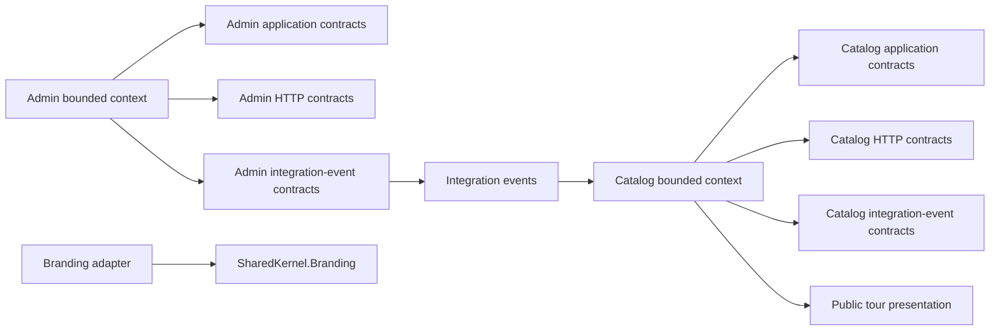
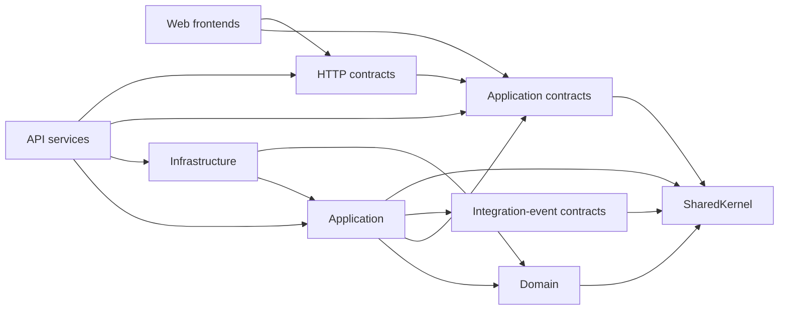

# Architecture boundaries and dependency flow

This page documents the current source-controlled dependency shape. Planned changes are listed
separately so diagrams can stay useful as repository structure evolves.

## Current bounded-context ownership

Admin owns booking and management workflows. Catalog owns public tour presentation. Branding rules
live in `SharedKernel.Branding`; the ViajantesTurismo Branding adapter owns app-specific persistence,
routes, defaults, and cache policy. Admin publishes integration events; Catalog consumes them and builds
public read models.


```mermaid
flowchart LR
    admin[Admin bounded context]
    adminAppContracts[Admin application contracts]
    adminHttpContracts[Admin HTTP contracts]
    adminEventContracts[Admin integration-event contracts]
    integration[Integration events]
    catalog[Catalog bounded context]
    catalogAppContracts[Catalog application contracts]
    catalogHttpContracts[Catalog HTTP contracts]
    catalogEventContracts[Catalog integration-event contracts]
    branding[Branding adapter]
    brandingCore[SharedKernel.Branding]
    publicRead[Public tour presentation]

    admin --> adminAppContracts
    admin --> adminHttpContracts
    admin --> adminEventContracts
    adminEventContracts --> integration
    integration --> catalog
    catalog --> catalogAppContracts
    catalog --> catalogHttpContracts
    catalog --> catalogEventContracts
    catalog --> publicRead
    branding --> brandingCore
```

Boundary rules:

- Admin business rules stay in `src/ViajantesTurismo.Admin.Domain`.
- Catalog presentation rules stay in `src/ViajantesTurismo.Catalog.Domain`.
- Reusable branding validation and public-safe contract rules stay in `SharedKernel.Branding`.
- ViajantesTurismo Branding API schema, persistence adapter, UI interpretation, and defaults stay outside SharedKernel.
- Catalog must not receive new branding behavior.
- Cross-context interaction uses contracts and integration events, not direct domain references.
- Public web reads Catalog contracts; it does not reference Admin projects.

Related docs: [Admin bounded context](../bounded-contexts/Admin.md),
[Catalog bounded context](../bounded-contexts/Catalog.md),
[Branding](../branding.md), and
[events and messaging](../domain/EVENTS_AND_MESSAGING.md).

## Current project dependency map

This diagram is generated from source project references.

<!-- generated:project-dependencies:start -->
<!-- Generated by tools/SharedKernel.Documentation.Tool. Do not edit by hand. -->

```mermaid
flowchart TB
    ViajantesTurismo_Admin_ApiService[ViajantesTurismo.Admin.ApiService] --> SharedKernel_ApiVersioning_AspNetCore[SharedKernel.ApiVersioning.AspNetCore]
    ViajantesTurismo_Admin_ApiService[ViajantesTurismo.Admin.ApiService] --> SharedKernel_AspNetCore[SharedKernel.AspNetCore]
    ViajantesTurismo_Admin_ApiService[ViajantesTurismo.Admin.ApiService] --> SharedKernel_Branding[SharedKernel.Branding]
    ViajantesTurismo_Admin_ApiService[ViajantesTurismo.Admin.ApiService] --> SharedKernel_OpenApi[SharedKernel.OpenApi]
    ViajantesTurismo_Admin_ApiService[ViajantesTurismo.Admin.ApiService] --> SharedKernel_Results[SharedKernel.Results]
    ViajantesTurismo_Admin_ApiService[ViajantesTurismo.Admin.ApiService] --> SharedKernel_Results_AspNet[SharedKernel.Results.AspNet]
    ViajantesTurismo_Admin_ApiService[ViajantesTurismo.Admin.ApiService] --> ViajantesTurismo_Admin_Application[ViajantesTurismo.Admin.Application]
    ViajantesTurismo_Admin_ApiService[ViajantesTurismo.Admin.ApiService] --> ViajantesTurismo_Admin_Contracts_Application[ViajantesTurismo.Admin.Contracts.Application]
    ViajantesTurismo_Admin_ApiService[ViajantesTurismo.Admin.ApiService] --> ViajantesTurismo_Admin_Contracts_Http[ViajantesTurismo.Admin.Contracts.Http]
    ViajantesTurismo_Admin_ApiService[ViajantesTurismo.Admin.ApiService] --> ViajantesTurismo_Admin_Infrastructure[ViajantesTurismo.Admin.Infrastructure]
    ViajantesTurismo_Admin_ApiService[ViajantesTurismo.Admin.ApiService] --> ViajantesTurismo_ServiceDefaults[ViajantesTurismo.ServiceDefaults]
    ViajantesTurismo_Admin_Application[ViajantesTurismo.Admin.Application] --> SharedKernel_Branding[SharedKernel.Branding]
    ViajantesTurismo_Admin_Application[ViajantesTurismo.Admin.Application] --> SharedKernel_BuildingBlocks[SharedKernel.BuildingBlocks]
    ViajantesTurismo_Admin_Application[ViajantesTurismo.Admin.Application] --> SharedKernel_DocumentRendering[SharedKernel.DocumentRendering]
    ViajantesTurismo_Admin_Application[ViajantesTurismo.Admin.Application] --> SharedKernel_DomainEvents[SharedKernel.DomainEvents]
    ViajantesTurismo_Admin_Application[ViajantesTurismo.Admin.Application] --> SharedKernel_InputNormalization[SharedKernel.InputNormalization]
    ViajantesTurismo_Admin_Application[ViajantesTurismo.Admin.Application] --> SharedKernel_Mediator_Abstractions[SharedKernel.Mediator.Abstractions]
    ViajantesTurismo_Admin_Application[ViajantesTurismo.Admin.Application] --> SharedKernel_Messaging_IntegrationEvents[SharedKernel.Messaging.IntegrationEvents]
    ViajantesTurismo_Admin_Application[ViajantesTurismo.Admin.Application] --> SharedKernel_Messaging_IntegrationEvents_SourceGenerator[SharedKernel.Messaging.IntegrationEvents.SourceGenerator]
    ViajantesTurismo_Admin_Application[ViajantesTurismo.Admin.Application] --> SharedKernel_Results[SharedKernel.Results]
    ViajantesTurismo_Admin_Application[ViajantesTurismo.Admin.Application] --> SharedKernel_Results_SourceGenerator[SharedKernel.Results.SourceGenerator]
    ViajantesTurismo_Admin_Application[ViajantesTurismo.Admin.Application] --> ViajantesTurismo_Admin_Contracts_Application[ViajantesTurismo.Admin.Contracts.Application]
    ViajantesTurismo_Admin_Application[ViajantesTurismo.Admin.Application] --> ViajantesTurismo_Admin_Contracts_IntegrationEvents[ViajantesTurismo.Admin.Contracts.IntegrationEvents]
    ViajantesTurismo_Admin_Application[ViajantesTurismo.Admin.Application] --> ViajantesTurismo_Admin_Domain[ViajantesTurismo.Admin.Domain]
    ViajantesTurismo_Admin_Contracts_Http[ViajantesTurismo.Admin.Contracts.Http] --> SharedKernel_HttpClients[SharedKernel.HttpClients]
    ViajantesTurismo_Admin_Contracts_Http[ViajantesTurismo.Admin.Contracts.Http] --> ViajantesTurismo_Admin_Contracts_Application[ViajantesTurismo.Admin.Contracts.Application]
    ViajantesTurismo_Admin_Contracts_IntegrationEvents[ViajantesTurismo.Admin.Contracts.IntegrationEvents] --> SharedKernel_Messaging_IntegrationEvents[SharedKernel.Messaging.IntegrationEvents]
    ViajantesTurismo_Admin_Domain[ViajantesTurismo.Admin.Domain] --> SharedKernel_BuildingBlocks[SharedKernel.BuildingBlocks]
    ViajantesTurismo_Admin_Domain[ViajantesTurismo.Admin.Domain] --> SharedKernel_Domain[SharedKernel.Domain]
    ViajantesTurismo_Admin_Domain[ViajantesTurismo.Admin.Domain] --> SharedKernel_Domain_SourceGenerator[SharedKernel.Domain.SourceGenerator]
    ViajantesTurismo_Admin_Domain[ViajantesTurismo.Admin.Domain] --> SharedKernel_InputNormalization[SharedKernel.InputNormalization]
    ViajantesTurismo_Admin_Domain[ViajantesTurismo.Admin.Domain] --> SharedKernel_Results[SharedKernel.Results]
    ViajantesTurismo_Admin_Domain[ViajantesTurismo.Admin.Domain] --> SharedKernel_Results_SourceGenerator[SharedKernel.Results.SourceGenerator]
    ViajantesTurismo_Admin_Infrastructure[ViajantesTurismo.Admin.Infrastructure] --> SharedKernel_DomainEvents[SharedKernel.DomainEvents]
    ViajantesTurismo_Admin_Infrastructure[ViajantesTurismo.Admin.Infrastructure] --> SharedKernel_DomainEvents_EntityFrameworkCore[SharedKernel.DomainEvents.EntityFrameworkCore]
    ViajantesTurismo_Admin_Infrastructure[ViajantesTurismo.Admin.Infrastructure] --> SharedKernel_EntityFrameworkCore[SharedKernel.EntityFrameworkCore]
    ViajantesTurismo_Admin_Infrastructure[ViajantesTurismo.Admin.Infrastructure] --> SharedKernel_InputNormalization[SharedKernel.InputNormalization]
    ViajantesTurismo_Admin_Infrastructure[ViajantesTurismo.Admin.Infrastructure] --> SharedKernel_Mediator_EntityFrameworkCore[SharedKernel.Mediator.EntityFrameworkCore]
    ViajantesTurismo_Admin_Infrastructure[ViajantesTurismo.Admin.Infrastructure] --> SharedKernel_Messaging_IntegrationEvents[SharedKernel.Messaging.IntegrationEvents]
    ViajantesTurismo_Admin_Infrastructure[ViajantesTurismo.Admin.Infrastructure] --> SharedKernel_Messaging_IntegrationEvents_EntityFrameworkCore[SharedKernel.Messaging.IntegrationEvents.EntityFrameworkCore]
    ViajantesTurismo_Admin_Infrastructure[ViajantesTurismo.Admin.Infrastructure] --> SharedKernel_OpenApi[SharedKernel.OpenApi]
    ViajantesTurismo_Admin_Infrastructure[ViajantesTurismo.Admin.Infrastructure] --> SharedKernel_Scheduling[SharedKernel.Scheduling]
    ViajantesTurismo_Admin_Infrastructure[ViajantesTurismo.Admin.Infrastructure] --> ViajantesTurismo_Admin_Application[ViajantesTurismo.Admin.Application]
    ViajantesTurismo_Admin_Infrastructure[ViajantesTurismo.Admin.Infrastructure] --> ViajantesTurismo_Admin_Domain[ViajantesTurismo.Admin.Domain]
    ViajantesTurismo_Admin_Infrastructure[ViajantesTurismo.Admin.Infrastructure] --> ViajantesTurismo_Resources[ViajantesTurismo.Resources]
    ViajantesTurismo_AppHost[ViajantesTurismo.AppHost] --> SharedKernel_Aspire_Analyzers[SharedKernel.Aspire.Analyzers]
    ViajantesTurismo_AppHost[ViajantesTurismo.AppHost] --> SharedKernel_Aspire_Hosting_ClamAv[SharedKernel.Aspire.Hosting.ClamAv]
    ViajantesTurismo_AppHost[ViajantesTurismo.AppHost] --> SharedKernel_Aspire_Hosting_Grafana[SharedKernel.Aspire.Hosting.Grafana]
    ViajantesTurismo_AppHost[ViajantesTurismo.AppHost] --> SharedKernel_Aspire_Hosting_SeaweedFs[SharedKernel.Aspire.Hosting.SeaweedFs]
    ViajantesTurismo_AppHost[ViajantesTurismo.AppHost] --> ViajantesTurismo_Admin_ApiService[ViajantesTurismo.Admin.ApiService]
    ViajantesTurismo_AppHost[ViajantesTurismo.AppHost] --> ViajantesTurismo_Branding_ApiService[ViajantesTurismo.Branding.ApiService]
    ViajantesTurismo_AppHost[ViajantesTurismo.AppHost] --> ViajantesTurismo_Catalog_ApiService[ViajantesTurismo.Catalog.ApiService]
    ViajantesTurismo_AppHost[ViajantesTurismo.AppHost] --> ViajantesTurismo_DatabaseObservability[ViajantesTurismo.DatabaseObservability]
    ViajantesTurismo_AppHost[ViajantesTurismo.AppHost] --> ViajantesTurismo_IntegrationEventWorker[ViajantesTurismo.IntegrationEventWorker]
    ViajantesTurismo_AppHost[ViajantesTurismo.AppHost] --> ViajantesTurismo_Management_Web[ViajantesTurismo.Management.Web]
    ViajantesTurismo_AppHost[ViajantesTurismo.AppHost] --> ViajantesTurismo_MigrationService[ViajantesTurismo.MigrationService]
    ViajantesTurismo_AppHost[ViajantesTurismo.AppHost] --> ViajantesTurismo_Public_Web[ViajantesTurismo.Public.Web]
    ViajantesTurismo_AppHost[ViajantesTurismo.AppHost] --> ViajantesTurismo_Resources[ViajantesTurismo.Resources]
    ViajantesTurismo_Branding_ApiService[ViajantesTurismo.Branding.ApiService] --> SharedKernel_ApiVersioning_AspNetCore[SharedKernel.ApiVersioning.AspNetCore]
    ViajantesTurismo_Branding_ApiService[ViajantesTurismo.Branding.ApiService] --> SharedKernel_AspNetCore[SharedKernel.AspNetCore]
    ViajantesTurismo_Branding_ApiService[ViajantesTurismo.Branding.ApiService] --> SharedKernel_Branding[SharedKernel.Branding]
    ViajantesTurismo_Branding_ApiService[ViajantesTurismo.Branding.ApiService] --> SharedKernel_HttpCaching_AspNetCore[SharedKernel.HttpCaching.AspNetCore]
    ViajantesTurismo_Branding_ApiService[ViajantesTurismo.Branding.ApiService] --> SharedKernel_OpenApi[SharedKernel.OpenApi]
    ViajantesTurismo_Branding_ApiService[ViajantesTurismo.Branding.ApiService] --> ViajantesTurismo_Branding_Infrastructure[ViajantesTurismo.Branding.Infrastructure]
    ViajantesTurismo_Branding_ApiService[ViajantesTurismo.Branding.ApiService] --> ViajantesTurismo_Resources[ViajantesTurismo.Resources]
    ViajantesTurismo_Branding_ApiService[ViajantesTurismo.Branding.ApiService] --> ViajantesTurismo_ServiceDefaults[ViajantesTurismo.ServiceDefaults]
    ViajantesTurismo_Branding_Infrastructure[ViajantesTurismo.Branding.Infrastructure] --> SharedKernel_Branding[SharedKernel.Branding]
    ViajantesTurismo_Branding_Infrastructure[ViajantesTurismo.Branding.Infrastructure] --> SharedKernel_EntityFrameworkCore[SharedKernel.EntityFrameworkCore]
    ViajantesTurismo_Branding_Infrastructure[ViajantesTurismo.Branding.Infrastructure] --> ViajantesTurismo_Resources[ViajantesTurismo.Resources]
    ViajantesTurismo_Catalog_ApiService[ViajantesTurismo.Catalog.ApiService] --> SharedKernel_ApiVersioning_AspNetCore[SharedKernel.ApiVersioning.AspNetCore]
    ViajantesTurismo_Catalog_ApiService[ViajantesTurismo.Catalog.ApiService] --> SharedKernel_AspNetCore[SharedKernel.AspNetCore]
    ViajantesTurismo_Catalog_ApiService[ViajantesTurismo.Catalog.ApiService] --> SharedKernel_HttpCaching_AspNetCore[SharedKernel.HttpCaching.AspNetCore]
    ViajantesTurismo_Catalog_ApiService[ViajantesTurismo.Catalog.ApiService] --> SharedKernel_OpenApi[SharedKernel.OpenApi]
    ViajantesTurismo_Catalog_ApiService[ViajantesTurismo.Catalog.ApiService] --> ViajantesTurismo_Catalog_Application[ViajantesTurismo.Catalog.Application]
    ViajantesTurismo_Catalog_ApiService[ViajantesTurismo.Catalog.ApiService] --> ViajantesTurismo_Catalog_Contracts_Application[ViajantesTurismo.Catalog.Contracts.Application]
    ViajantesTurismo_Catalog_ApiService[ViajantesTurismo.Catalog.ApiService] --> ViajantesTurismo_Catalog_Contracts_Http[ViajantesTurismo.Catalog.Contracts.Http]
    ViajantesTurismo_Catalog_ApiService[ViajantesTurismo.Catalog.ApiService] --> ViajantesTurismo_Catalog_Infrastructure[ViajantesTurismo.Catalog.Infrastructure]
    ViajantesTurismo_Catalog_ApiService[ViajantesTurismo.Catalog.ApiService] --> ViajantesTurismo_ServiceDefaults[ViajantesTurismo.ServiceDefaults]
    ViajantesTurismo_Catalog_Application[ViajantesTurismo.Catalog.Application] --> SharedKernel_AI[SharedKernel.AI]
    ViajantesTurismo_Catalog_Application[ViajantesTurismo.Catalog.Application] --> SharedKernel_BuildingBlocks[SharedKernel.BuildingBlocks]
    ViajantesTurismo_Catalog_Application[ViajantesTurismo.Catalog.Application] --> SharedKernel_EventSourcing[SharedKernel.EventSourcing]
    ViajantesTurismo_Catalog_Application[ViajantesTurismo.Catalog.Application] --> SharedKernel_Idempotency[SharedKernel.Idempotency]
    ViajantesTurismo_Catalog_Application[ViajantesTurismo.Catalog.Application] --> SharedKernel_ImageProcessing[SharedKernel.ImageProcessing]
    ViajantesTurismo_Catalog_Application[ViajantesTurismo.Catalog.Application] --> SharedKernel_InputNormalization[SharedKernel.InputNormalization]
    ViajantesTurismo_Catalog_Application[ViajantesTurismo.Catalog.Application] --> SharedKernel_Mediator_Abstractions[SharedKernel.Mediator.Abstractions]
    ViajantesTurismo_Catalog_Application[ViajantesTurismo.Catalog.Application] --> SharedKernel_Messaging[SharedKernel.Messaging]
    ViajantesTurismo_Catalog_Application[ViajantesTurismo.Catalog.Application] --> SharedKernel_Messaging_IntegrationEvents[SharedKernel.Messaging.IntegrationEvents]
    ViajantesTurismo_Catalog_Application[ViajantesTurismo.Catalog.Application] --> SharedKernel_Results[SharedKernel.Results]
    ViajantesTurismo_Catalog_Application[ViajantesTurismo.Catalog.Application] --> ViajantesTurismo_Admin_Contracts_IntegrationEvents[ViajantesTurismo.Admin.Contracts.IntegrationEvents]
    ViajantesTurismo_Catalog_Application[ViajantesTurismo.Catalog.Application] --> ViajantesTurismo_Catalog_Contracts_Application[ViajantesTurismo.Catalog.Contracts.Application]
    ViajantesTurismo_Catalog_Application[ViajantesTurismo.Catalog.Application] --> ViajantesTurismo_Catalog_Contracts_IntegrationEvents[ViajantesTurismo.Catalog.Contracts.IntegrationEvents]
    ViajantesTurismo_Catalog_Application[ViajantesTurismo.Catalog.Application] --> ViajantesTurismo_Catalog_Domain[ViajantesTurismo.Catalog.Domain]
    ViajantesTurismo_Catalog_Contracts_Http[ViajantesTurismo.Catalog.Contracts.Http] --> SharedKernel_HttpClients[SharedKernel.HttpClients]
    ViajantesTurismo_Catalog_Contracts_Http[ViajantesTurismo.Catalog.Contracts.Http] --> ViajantesTurismo_Catalog_Contracts_Application[ViajantesTurismo.Catalog.Contracts.Application]
    ViajantesTurismo_Catalog_Contracts_IntegrationEvents[ViajantesTurismo.Catalog.Contracts.IntegrationEvents] --> SharedKernel_Messaging_IntegrationEvents[SharedKernel.Messaging.IntegrationEvents]
    ViajantesTurismo_Catalog_Domain[ViajantesTurismo.Catalog.Domain] --> SharedKernel_BuildingBlocks[SharedKernel.BuildingBlocks]
    ViajantesTurismo_Catalog_Domain[ViajantesTurismo.Catalog.Domain] --> SharedKernel_Domain[SharedKernel.Domain]
    ViajantesTurismo_Catalog_Domain[ViajantesTurismo.Catalog.Domain] --> SharedKernel_Domain_SourceGenerator[SharedKernel.Domain.SourceGenerator]
    ViajantesTurismo_Catalog_Domain[ViajantesTurismo.Catalog.Domain] --> SharedKernel_EventSourcing[SharedKernel.EventSourcing]
    ViajantesTurismo_Catalog_Domain[ViajantesTurismo.Catalog.Domain] --> SharedKernel_InputNormalization[SharedKernel.InputNormalization]
    ViajantesTurismo_Catalog_Domain[ViajantesTurismo.Catalog.Domain] --> SharedKernel_Results[SharedKernel.Results]
    ViajantesTurismo_Catalog_Infrastructure[ViajantesTurismo.Catalog.Infrastructure] --> SharedKernel_AI[SharedKernel.AI]
    ViajantesTurismo_Catalog_Infrastructure[ViajantesTurismo.Catalog.Infrastructure] --> SharedKernel_EntityFrameworkCore[SharedKernel.EntityFrameworkCore]
    ViajantesTurismo_Catalog_Infrastructure[ViajantesTurismo.Catalog.Infrastructure] --> SharedKernel_EventSourcing_Npgsql[SharedKernel.EventSourcing.Npgsql]
    ViajantesTurismo_Catalog_Infrastructure[ViajantesTurismo.Catalog.Infrastructure] --> SharedKernel_HttpClients[SharedKernel.HttpClients]
    ViajantesTurismo_Catalog_Infrastructure[ViajantesTurismo.Catalog.Infrastructure] --> SharedKernel_Idempotency[SharedKernel.Idempotency]
    ViajantesTurismo_Catalog_Infrastructure[ViajantesTurismo.Catalog.Infrastructure] --> SharedKernel_InputNormalization[SharedKernel.InputNormalization]
    ViajantesTurismo_Catalog_Infrastructure[ViajantesTurismo.Catalog.Infrastructure] --> SharedKernel_Messaging_IntegrationEvents_EntityFrameworkCore[SharedKernel.Messaging.IntegrationEvents.EntityFrameworkCore]
    ViajantesTurismo_Catalog_Infrastructure[ViajantesTurismo.Catalog.Infrastructure] --> SharedKernel_OpenApi[SharedKernel.OpenApi]
    ViajantesTurismo_Catalog_Infrastructure[ViajantesTurismo.Catalog.Infrastructure] --> SharedKernel_Scheduling[SharedKernel.Scheduling]
    ViajantesTurismo_Catalog_Infrastructure[ViajantesTurismo.Catalog.Infrastructure] --> ViajantesTurismo_Catalog_Application[ViajantesTurismo.Catalog.Application]
    ViajantesTurismo_Catalog_Infrastructure[ViajantesTurismo.Catalog.Infrastructure] --> ViajantesTurismo_Catalog_Domain[ViajantesTurismo.Catalog.Domain]
    ViajantesTurismo_Catalog_Infrastructure[ViajantesTurismo.Catalog.Infrastructure] --> ViajantesTurismo_Resources[ViajantesTurismo.Resources]
    ViajantesTurismo_DatabaseObservability[ViajantesTurismo.DatabaseObservability] --> SharedKernel_Observability_Npgsql[SharedKernel.Observability.Npgsql]
    ViajantesTurismo_DatabaseObservability[ViajantesTurismo.DatabaseObservability] --> ViajantesTurismo_ServiceDefaults[ViajantesTurismo.ServiceDefaults]
    ViajantesTurismo_IntegrationEventWorker[ViajantesTurismo.IntegrationEventWorker] --> ViajantesTurismo_Catalog_Infrastructure[ViajantesTurismo.Catalog.Infrastructure]
    ViajantesTurismo_IntegrationEventWorker[ViajantesTurismo.IntegrationEventWorker] --> ViajantesTurismo_ServiceDefaults[ViajantesTurismo.ServiceDefaults]
    ViajantesTurismo_Management_Web[ViajantesTurismo.Management.Web] --> SharedKernel_AspNetCore[SharedKernel.AspNetCore]
    ViajantesTurismo_Management_Web[ViajantesTurismo.Management.Web] --> SharedKernel_Branding[SharedKernel.Branding]
    ViajantesTurismo_Management_Web[ViajantesTurismo.Management.Web] --> SharedKernel_BuildingBlocks[SharedKernel.BuildingBlocks]
    ViajantesTurismo_Management_Web[ViajantesTurismo.Management.Web] --> SharedKernel_HttpCaching_AspNetCore[SharedKernel.HttpCaching.AspNetCore]
    ViajantesTurismo_Management_Web[ViajantesTurismo.Management.Web] --> SharedKernel_HttpClients[SharedKernel.HttpClients]
    ViajantesTurismo_Management_Web[ViajantesTurismo.Management.Web] --> SharedKernel_Npgsql[SharedKernel.Npgsql]
    ViajantesTurismo_Management_Web[ViajantesTurismo.Management.Web] --> ViajantesTurismo_Admin_Contracts_Application[ViajantesTurismo.Admin.Contracts.Application]
    ViajantesTurismo_Management_Web[ViajantesTurismo.Management.Web] --> ViajantesTurismo_Admin_Contracts_Http[ViajantesTurismo.Admin.Contracts.Http]
    ViajantesTurismo_Management_Web[ViajantesTurismo.Management.Web] --> ViajantesTurismo_Catalog_Contracts_Application[ViajantesTurismo.Catalog.Contracts.Application]
    ViajantesTurismo_Management_Web[ViajantesTurismo.Management.Web] --> ViajantesTurismo_Catalog_Contracts_Http[ViajantesTurismo.Catalog.Contracts.Http]
    ViajantesTurismo_Management_Web[ViajantesTurismo.Management.Web] --> ViajantesTurismo_Management_Security[ViajantesTurismo.Management.Security]
    ViajantesTurismo_Management_Web[ViajantesTurismo.Management.Web] --> ViajantesTurismo_Resources[ViajantesTurismo.Resources]
    ViajantesTurismo_Management_Web[ViajantesTurismo.Management.Web] --> ViajantesTurismo_ServiceDefaults[ViajantesTurismo.ServiceDefaults]
    ViajantesTurismo_MigrationService[ViajantesTurismo.MigrationService] --> SharedKernel_Branding[SharedKernel.Branding]
    ViajantesTurismo_MigrationService[ViajantesTurismo.MigrationService] --> SharedKernel_EventSourcing_Npgsql[SharedKernel.EventSourcing.Npgsql]
    ViajantesTurismo_MigrationService[ViajantesTurismo.MigrationService] --> ViajantesTurismo_Admin_Application[ViajantesTurismo.Admin.Application]
    ViajantesTurismo_MigrationService[ViajantesTurismo.MigrationService] --> ViajantesTurismo_Admin_Infrastructure[ViajantesTurismo.Admin.Infrastructure]
    ViajantesTurismo_MigrationService[ViajantesTurismo.MigrationService] --> ViajantesTurismo_Branding_Infrastructure[ViajantesTurismo.Branding.Infrastructure]
    ViajantesTurismo_MigrationService[ViajantesTurismo.MigrationService] --> ViajantesTurismo_Catalog_Infrastructure[ViajantesTurismo.Catalog.Infrastructure]
    ViajantesTurismo_MigrationService[ViajantesTurismo.MigrationService] --> ViajantesTurismo_Management_Security[ViajantesTurismo.Management.Security]
    ViajantesTurismo_MigrationService[ViajantesTurismo.MigrationService] --> ViajantesTurismo_Resources[ViajantesTurismo.Resources]
    ViajantesTurismo_MigrationService[ViajantesTurismo.MigrationService] --> ViajantesTurismo_ServiceDefaults[ViajantesTurismo.ServiceDefaults]
    ViajantesTurismo_Public_Web[ViajantesTurismo.Public.Web] --> SharedKernel_AspNetCore[SharedKernel.AspNetCore]
    ViajantesTurismo_Public_Web[ViajantesTurismo.Public.Web] --> SharedKernel_Branding[SharedKernel.Branding]
    ViajantesTurismo_Public_Web[ViajantesTurismo.Public.Web] --> SharedKernel_HttpCaching_AspNetCore[SharedKernel.HttpCaching.AspNetCore]
    ViajantesTurismo_Public_Web[ViajantesTurismo.Public.Web] --> SharedKernel_HttpClients[SharedKernel.HttpClients]
    ViajantesTurismo_Public_Web[ViajantesTurismo.Public.Web] --> ViajantesTurismo_Catalog_Contracts_Application[ViajantesTurismo.Catalog.Contracts.Application]
    ViajantesTurismo_Public_Web[ViajantesTurismo.Public.Web] --> ViajantesTurismo_Catalog_Contracts_Http[ViajantesTurismo.Catalog.Contracts.Http]
    ViajantesTurismo_Public_Web[ViajantesTurismo.Public.Web] --> ViajantesTurismo_Resources[ViajantesTurismo.Resources]
    ViajantesTurismo_Public_Web[ViajantesTurismo.Public.Web] --> ViajantesTurismo_ServiceDefaults[ViajantesTurismo.ServiceDefaults]
    ViajantesTurismo_ServiceDefaults[ViajantesTurismo.ServiceDefaults] --> SharedKernel_Mediator_Abstractions[SharedKernel.Mediator.Abstractions]
    ViajantesTurismo_ServiceDefaults[ViajantesTurismo.ServiceDefaults] --> SharedKernel_Observability[SharedKernel.Observability]
    ViajantesTurismo_ServiceDefaults[ViajantesTurismo.ServiceDefaults] --> SharedKernel_OpenApi[SharedKernel.OpenApi]
    ViajantesTurismo_ServiceDefaults[ViajantesTurismo.ServiceDefaults] --> ViajantesTurismo_Resources[ViajantesTurismo.Resources]
```
<!-- generated:project-dependencies:end -->

## Allowed and forbidden dependency directions


```mermaid
flowchart LR
    ui[Web frontends]
    api[API services]
    infra[Infrastructure]
    app[Application]
    domain[Domain]
    appContracts[Application contracts]
    httpContracts[HTTP contracts]
    eventContracts[Integration-event contracts]
    shared[SharedKernel]

    ui --> appContracts
    ui --> httpContracts
    api --> app
    api --> infra
    api --> appContracts
    api --> httpContracts
    infra --> app
    infra --> domain
    app --> domain
    app --> appContracts
    app --> eventContracts
    domain --> shared
    app --> shared
    httpContracts --> appContracts
    appContracts --> shared
    eventContracts --> shared
```

Forbidden directions:

- Domain must not reference application, API, infrastructure, web, AppHost, migration, or contract
  projects. Domain projects must not reference any `ViajantesTurismo.*.Contracts.*` project.
- Product contract projects must use `.Contracts.Application`, `.Contracts.Http`, or `.Contracts.IntegrationEvents`.
- `.Contracts.Application` owns use-case DTOs and validation shape. It must not reference product
  projects.
- `.Contracts.Http` owns typed HTTP clients and OpenAPI artifacts. It may reference only the
  same-context `.Contracts.Application` project among product projects.
- `.Contracts.IntegrationEvents` owns asynchronous cross-context event contracts. It must not reference
  product projects.
- Application must not depend on infrastructure, API, web, AppHost, or migration projects. Application
  may reference same-context `.Contracts.Application` and any `.Contracts.IntegrationEvents` project.
- Infrastructure must not depend on API or web projects.
- API services may reference same-context `.Contracts.Application` and `.Contracts.Http` projects.
- Web frontends may reference `.Contracts.Application` and `.Contracts.Http` projects, but must not
  reference domain, application, infrastructure, API implementation, or integration-event contract
  projects directly.
- Catalog must not call Admin application, domain, infrastructure, API, HTTP contract, or application
  contract code directly. Cross-context Catalog-to-Admin references are limited to
  `ViajantesTurismo.Admin.Contracts.IntegrationEvents`.
- SharedKernel modules must not depend on bounded-context projects.

## Current SharedKernel module map

This diagram is generated from SharedKernel project references.

<!-- generated:sharedkernel-dependencies:start -->
<!-- Generated by tools/SharedKernel.Documentation.Tool. Do not edit by hand. -->


```mermaid
flowchart TB
    SharedKernel_ApiVersioning_AspNetCore[SharedKernel.ApiVersioning.AspNetCore] --> SharedKernel_ApiVersioning[SharedKernel.ApiVersioning]
    SharedKernel_AspNetCore[SharedKernel.AspNetCore] --> SharedKernel_InputNormalization[SharedKernel.InputNormalization]
    SharedKernel_AspNetCore[SharedKernel.AspNetCore] --> SharedKernel_OpenApi[SharedKernel.OpenApi]
    SharedKernel_Branding[SharedKernel.Branding] --> SharedKernel_HttpClients[SharedKernel.HttpClients]
    SharedKernel_Branding[SharedKernel.Branding] --> SharedKernel_InputNormalization[SharedKernel.InputNormalization]
    SharedKernel_Branding[SharedKernel.Branding] --> SharedKernel_Results[SharedKernel.Results]
    SharedKernel_BuildingBlocks[SharedKernel.BuildingBlocks] --> SharedKernel_Results[SharedKernel.Results]
    SharedKernel_DocumentRendering[SharedKernel.DocumentRendering] --> SharedKernel_InputNormalization[SharedKernel.InputNormalization]
    SharedKernel_Domain[SharedKernel.Domain] --> SharedKernel_BuildingBlocks[SharedKernel.BuildingBlocks]
    SharedKernel_DomainEvents[SharedKernel.DomainEvents] --> SharedKernel_Domain[SharedKernel.Domain]
    SharedKernel_DomainEvents[SharedKernel.DomainEvents] --> SharedKernel_Mediator_Abstractions[SharedKernel.Mediator.Abstractions]
    SharedKernel_DomainEvents_EntityFrameworkCore[SharedKernel.DomainEvents.EntityFrameworkCore] --> SharedKernel_Domain[SharedKernel.Domain]
    SharedKernel_DomainEvents_EntityFrameworkCore[SharedKernel.DomainEvents.EntityFrameworkCore] --> SharedKernel_DomainEvents[SharedKernel.DomainEvents]
    SharedKernel_DomainEvents_EntityFrameworkCore[SharedKernel.DomainEvents.EntityFrameworkCore] --> SharedKernel_EntityFrameworkCore[SharedKernel.EntityFrameworkCore]
    SharedKernel_EventSourcing_Npgsql[SharedKernel.EventSourcing.Npgsql] --> SharedKernel_BuildingBlocks[SharedKernel.BuildingBlocks]
    SharedKernel_EventSourcing_Npgsql[SharedKernel.EventSourcing.Npgsql] --> SharedKernel_EventSourcing[SharedKernel.EventSourcing]
    SharedKernel_EventSourcing_Npgsql[SharedKernel.EventSourcing.Npgsql] --> SharedKernel_Npgsql[SharedKernel.Npgsql]
    SharedKernel_Idempotency_EntityFrameworkCore[SharedKernel.Idempotency.EntityFrameworkCore] --> SharedKernel_EntityFrameworkCore[SharedKernel.EntityFrameworkCore]
    SharedKernel_Idempotency_EntityFrameworkCore[SharedKernel.Idempotency.EntityFrameworkCore] --> SharedKernel_Idempotency[SharedKernel.Idempotency]
    SharedKernel_Mediator[SharedKernel.Mediator] --> SharedKernel_Mediator_Abstractions[SharedKernel.Mediator.Abstractions]
    SharedKernel_Mediator_EntityFrameworkCore[SharedKernel.Mediator.EntityFrameworkCore] --> SharedKernel_EntityFrameworkCore[SharedKernel.EntityFrameworkCore]
    SharedKernel_Mediator_EntityFrameworkCore[SharedKernel.Mediator.EntityFrameworkCore] --> SharedKernel_Mediator_Abstractions[SharedKernel.Mediator.Abstractions]
    SharedKernel_Messaging_IntegrationEvents[SharedKernel.Messaging.IntegrationEvents] --> SharedKernel_Mediator_Abstractions[SharedKernel.Mediator.Abstractions]
    SharedKernel_Messaging_IntegrationEvents[SharedKernel.Messaging.IntegrationEvents] --> SharedKernel_Messaging[SharedKernel.Messaging]
    SharedKernel_Messaging_IntegrationEvents_CloudEvents[SharedKernel.Messaging.IntegrationEvents.CloudEvents] --> SharedKernel_Messaging_IntegrationEvents[SharedKernel.Messaging.IntegrationEvents]
    SharedKernel_Messaging_IntegrationEvents_EntityFrameworkCore[SharedKernel.Messaging.IntegrationEvents.EntityFrameworkCore] --> SharedKernel_EntityFrameworkCore[SharedKernel.EntityFrameworkCore]
    SharedKernel_Messaging_IntegrationEvents_EntityFrameworkCore[SharedKernel.Messaging.IntegrationEvents.EntityFrameworkCore] --> SharedKernel_Idempotency_EntityFrameworkCore[SharedKernel.Idempotency.EntityFrameworkCore]
    SharedKernel_Messaging_IntegrationEvents_EntityFrameworkCore[SharedKernel.Messaging.IntegrationEvents.EntityFrameworkCore] --> SharedKernel_Messaging[SharedKernel.Messaging]
    SharedKernel_Messaging_IntegrationEvents_EntityFrameworkCore[SharedKernel.Messaging.IntegrationEvents.EntityFrameworkCore] --> SharedKernel_Messaging_IntegrationEvents[SharedKernel.Messaging.IntegrationEvents]
    SharedKernel_Messaging_IntegrationEvents_EntityFrameworkCore[SharedKernel.Messaging.IntegrationEvents.EntityFrameworkCore] --> SharedKernel_Scheduling[SharedKernel.Scheduling]
    SharedKernel_OpenApi[SharedKernel.OpenApi] --> SharedKernel_ApiVersioning[SharedKernel.ApiVersioning]
    SharedKernel_Results[SharedKernel.Results] --> SharedKernel_Results_SourceGenerator[SharedKernel.Results.SourceGenerator]
    SharedKernel_Results_AspNet[SharedKernel.Results.AspNet] --> SharedKernel_Results[SharedKernel.Results]
    SharedKernel_Style_CodeFixes[SharedKernel.Style.CodeFixes] --> SharedKernel_Style_Analyzers[SharedKernel.Style.Analyzers]
    SharedKernel_Testing_CodeFixes[SharedKernel.Testing.CodeFixes] --> SharedKernel_Testing_Analyzers[SharedKernel.Testing.Analyzers]
    SharedKernel_Testing_Mediator[SharedKernel.Testing.Mediator] --> SharedKernel_Mediator_Abstractions[SharedKernel.Mediator.Abstractions]
```
<!-- generated:sharedkernel-dependencies:end -->

Module rules:

- Treat `src/SharedKernel` as the seed of a future standalone reusable-library repository. SharedKernel
  modules should remain movable without bounded-context code, app configuration, or host assumptions.
- Put reusable domain primitives in `SharedKernel.Domain` or `SharedKernel.BuildingBlocks`.
- Put reusable contracts for dispatching in mediator or integration-event modules.
- Put provider-specific persistence in provider modules such as
  `SharedKernel.EventSourcing.Npgsql`.
- A new SharedKernel implementation does not need two in-repo callers when it provides a current,
  stable, host-agnostic reusable-library capability.
- Do not put bounded-context business rules, resource names, endpoint routes, or operational policy in
  SharedKernel modules.
- Keep analyzers, source generators, and code fixes in their current tool-specific modules.

Module naming and dependency rules:

- `SharedKernel.<Capability>` is the primary module and core surface for that capability. Capability
  families may be multi-segment, such as `SharedKernel.Messaging.IntegrationEvents`; the primary module
  owns shared runtime and core logic for that full family name.
- Do not create `SharedKernel.<Capability>.Core` packages. Add a `Core` package only after an ADR or
  compatibility constraint records why the primary module cannot own the core surface.
- `SharedKernel.<Capability>.<Submodule>` names an optional surface with an independent reason to exist
  now, such as a provider adapter, ASP.NET adapter, CloudEvents adapter, Roslyn component, source
  generator, or explicit abstraction split. Optional/provider/tool suffixes are not allowed to point
  sideways within the same family.
- Primary modules must not runtime-reference descendant optional submodules through project or package
  references. Optional submodules may reference the same-family primary module, a nearer parent module,
  or an explicit `Abstractions` module.
- Cross-family SharedKernel references may target stable reusable primary modules, abstraction modules,
  or explicitly lower-level provider primitives. Do not use arbitrary sideways coupling to borrow
  runtime details from another family.
- Non-runtime analyzer, source-generator, code-fix, and packaging references may point from a primary
  package to a tool package only when `ReferenceOutputAssembly="false"` or an analyzer/package output
  item type keeps the tool out of the runtime dependency graph.
- `Abstractions` modules are dependency-inversion surfaces, not implementation hosts.
- Abstraction projects must not reference same-family implementation packages, provider adapters, persistence projects, web/API hosts, or adapter packages.
- Domain-facing and application-facing abstractions stay provider-neutral. Infrastructure, persistence,
  hosting, web, and provider SDK dependencies belong in infrastructure/provider modules or application
  composition roots.
- If a module needs both an abstraction split and a provider split, keep the contract package inward and
  let provider modules depend on that contract; do not route contract packages through provider modules.

Implemented architecture guardrails:

- SharedKernel project names fail when `Core` is used as a project-name segment.
- SharedKernel primary modules fail when they runtime-reference descendant optional submodules through
  project or package references.
- SharedKernel optional submodules fail when they runtime-reference same-family optional siblings through
  project or package references.
- Project references fail when they violate the documented layer directions.
- Domain projects fail when they reference any product contract project.
- Product contract projects fail when they use the unsplit `ViajantesTurismo.*.Contracts` project shape.
- `Abstractions` projects fail when they reference same-family implementations, outward DDD layers,
  implementation/adapters, or adapter packages.
- Domain/application/contract projects fail when they reference adapter packages.
- Provider-neutral SharedKernel projects fail when they reference adapter packages.

Related decisions:

- [split SharedKernel domain and building blocks](../adr/20260621-split-sharedkernel-domain-and-building-blocks.md)
- provider-specific SharedKernel infrastructure modules in
  [Architecture decisions](../ARCHITECTURE_DECISIONS.md#architecture--layers)
- domain materialization and persistence boundaries in
  [Architecture decisions](../ARCHITECTURE_DECISIONS.md#architecture--layers)

## Planned improvements

- Keep SharedKernel provider packages small and library-shaped so they can move to the future standalone
  SharedKernel repository without application-specific dependencies.
- Generate diagrams from project, AppHost, or workflow sources when practical. Keep hand-authored
  diagrams only for conceptual rules that do not have a single source file.
