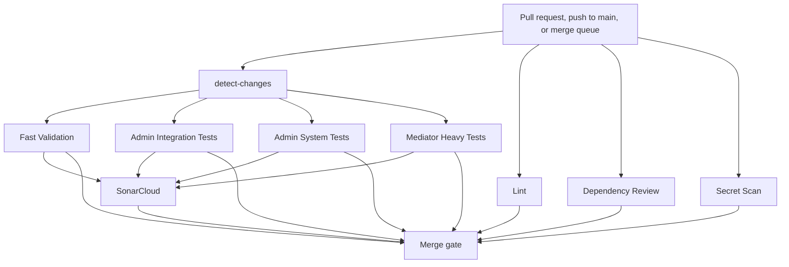
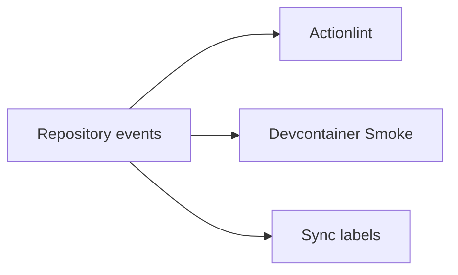
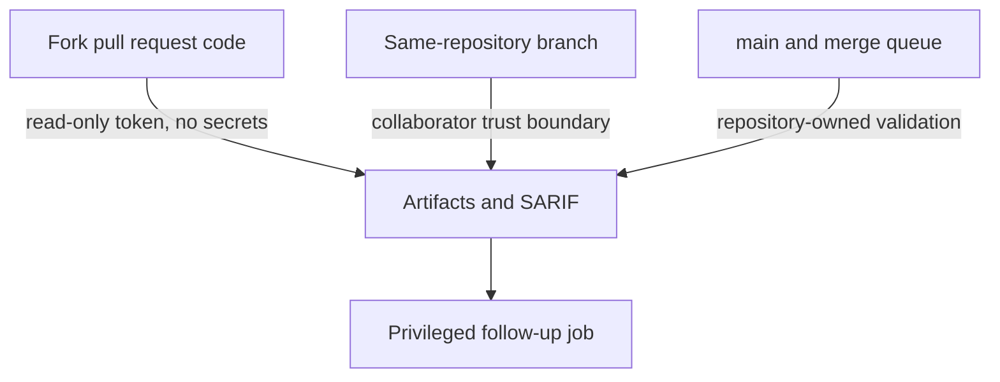

# CI and local validation flow

This page summarizes the current validation architecture and links the maintainable source docs. It
separates required merge gates from supplemental workflows and local reproduction paths.

## Current required merge-gate lanes

Required checks:

- `Fast Validation`
- `Admin Integration Tests`
- `Admin System Tests`
- `Mediator Heavy Tests`
- `Lint`
- `Dependency Review`
- `Secret Scan`
- `SonarCloud`

Source docs: [CI overview](../ci/overview.md), [main workflow](../ci/main-workflow.md), and
[governance](../ci/governance.md).

## Fast lanes versus dependency-heavy lanes

| Lane | Current purpose | Cost posture |
| --- | --- | --- |
| `Fast Validation` | Build and test the fast project set. | Default application feedback path. |
| `Lint` | Markdown, scripts, specs, and repository quality checks. | Fast; runs independently. |
| `Dependency Review` | Scan dependency manifest and lock-file diffs. | Fast governance lane. |
| `Secret Scan` | Detect committed secrets and publish SARIF when allowed. | Fast security lane. |
| `Admin Integration Tests` | Run database-backed Admin integration tests. | Heavier; path-gated. |
| `Admin System Tests` | Run hosted UI/system tests with Playwright Chromium. | Heavier; path-gated. |
| `Mediator Heavy Tests` | Run source-generator, analyzer, and mediator-heavy tests. | Heavier; path-gated. |
| `SonarCloud` | Aggregate coverage and run hosted analysis. | Dependency-heavy; secret-aware. |

`scripts/detect-changes.sh` owns the path decisions. If diff detection is uncertain, it fails open so
CI runs more work rather than skipping a needed check.

## Supplemental workflows

Supplemental workflows are intentionally outside the normal required merge gate:

- `Actionlint` validates workflow edits and local composite actions.
- `Devcontainer Smoke` validates the containerized developer path on schedule, manual dispatch, and
  post-merge devcontainer-sensitive changes.
- `Sync labels` is repository-owned administrative automation and never runs on pull requests.

Source doc: [supplemental workflows](../ci/supplemental-workflows.md).

## Local reproduction commands

Use the narrowest command that reproduces the failing lane.

| Area | Command |
| --- | --- |
| Full build | `dotnet build ViajantesTurismo.slnx` |
| Full test suite | `dotnet test --solution ViajantesTurismo.slnx` |
| Repository docs/scripts/spec lint | `bash scripts/lint-all.sh` |
| CI change classification | `bash scripts/detect-changes.sh` |
| Devcontainer smoke | `bash scripts/run-devcontainer-smoke.sh` |
| Devcontainer deeper validation | `bash scripts/run-devcontainer-smoke.sh --run-tests` |
| Aspire local run | `dotnet tool run aspire run` |

More details: [artifacts and local reproduction](../ci/artifacts-and-local-reproduction.md),
[Code Quality Tools](../CODE_QUALITY.md), and [Dev Containers](../DEVCONTAINERS.md).

## Trust boundaries

Current rules:

- Build, test, and analysis workflows use `pull_request`, not `pull_request_target`.
- Fork pull request code must not receive repository secrets or write-scoped tokens.
- Secret-dependent SonarCloud steps must handle fork pull requests explicitly.
- Generated artifacts and SARIF are handoffs; privileged upload jobs stay separate from scanners.
- Same-repository pull requests are the collaborator trust boundary for secret-bearing work.

Source docs: [trust boundaries](../ci/trust-boundaries.md),
[security hardening baseline](../ci/security-hardening.md), and
[telemetry and generated guardrails](../ci/telemetry-generated-guardrails.md).

## Planned improvements

- Tune path gates only when timing and reliability data justify the change.
- Keep devcontainer smoke supplemental unless container drift becomes a repeated blocker.
- Add new required lanes only when they protect real merge risk and have clear local reproduction.
