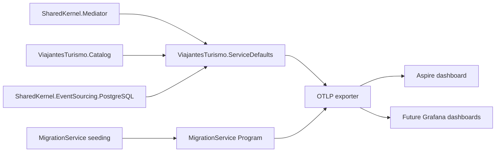
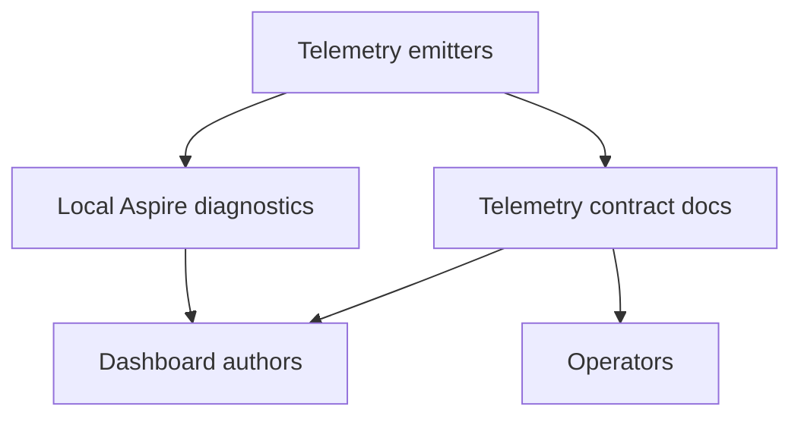

# Observability Signal and Dashboard Consumption Flows

This page maps repository-owned telemetry from emitters to registration points and consumers. The
contract details live in [OpenTelemetry custom telemetry](../OPEN_TELEMETRY.md).

## Signal flow

Service defaults register shared ActivitySource and Meter names for application services. The
migration service registers its seeding ActivitySource explicitly because it owns the worker span.

## Consumer boundaries

Developers use the Aspire dashboard for local log, trace, and metric inspection. Operators and
dashboard authors should consume only the stable names and dimensions documented in the telemetry
contract.

## Dashboard authoring rules

- Start from operational questions, not available tags.
- Use low-cardinality dimensions: service, bounded context, operation, provider, severity, and outcome.
- Avoid raw IDs, event payload values, exception messages, user content, and trace IDs as dashboard
  variables or group-by labels.
- Treat log categories, event IDs, message-template placeholder names, span tags, and metric
  dimensions as stable contracts once dashboards or alerts consume them.
- Keep Grafana assets out of the repository until provisioning and validation are part of local
  checks.
- Prefer backend-neutral query intent in docs before committing dashboard JSON.

## Cancellation and error interpretation

Cooperative cancellation is not an application failure. Custom telemetry should leave cancelled
spans with unset status, no exception event, and no error metric increments. Failure paths should
record error status, one exception event, and the surface-owned error outcome metric where defined.
Cancellation logs should not use error severity when the operation's cancellation token is signaled.
Unexpected `OperationCanceledException` with an unsignaled token should follow the normal error path.
