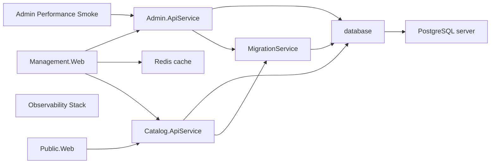
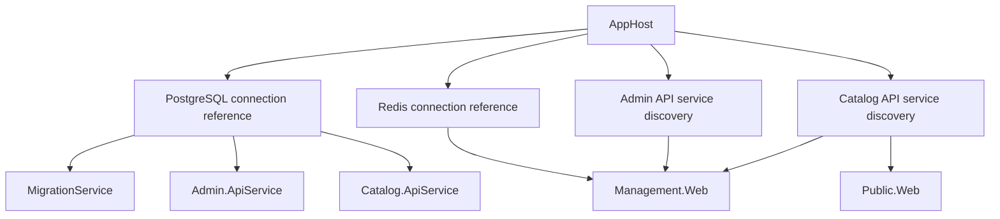

# Runtime wiring and deployment mapping

This page separates the current local Aspire model from deployment guidance and planned runtime
improvements. Secret values are intentionally omitted.

## Current local Aspire resource graph

`src/ViajantesTurismo.AppHost/AppHost.cs` is the source of truth for local runtime wiring.

<!-- generated:apphost-resources:start -->
<!-- Generated by scripts/update-architecture-diagrams.py. Do not edit by hand. -->

<!-- generated:apphost-resources:end -->

Current AppHost rules:

- Infrastructure resources are declared before services.
- `MigrationService` waits for the database.
- Admin and Catalog APIs wait for database migration completion.
- Management Web waits for Redis, Admin API, and Catalog API.
- Public Web waits for Catalog API.
- API services stay internal; web frontends expose external HTTP endpoints.
- The performance smoke resource is opt-in through `VT_ASPIRE_ENABLE_PERFORMANCE_TESTS=1`.

## Current service references

Reference rules:

- Use `.WithReference(...)` for connection strings and service discovery injection.
- Do not copy generated connection strings or endpoint URLs into docs or settings files.
- Keep resource names centralized in `src/ViajantesTurismo.Resources/ResourceNames.cs`.
- Keep local-only ports in launch settings and AppHost configuration, not production docs.

## Production runtime configuration boundary

Production runtime options are documented in [Configuration Standards](../CONFIGURATION.md). The
current production-overridable option is
`CatalogIntegrationEvents:IdempotencyLockDuration`, with environment variable form
`CatalogIntegrationEvents__IdempotencyLockDuration`.

Deployment mapping:

| Source | Deployment target | Boundary |
| --- | --- | --- |
| Production runtime option | App setting or environment variable on the consuming service | Operator-facing. |
| Secret or credential | Managed secret store, deployment secret, or platform secret reference | No sample values. |
| Connection string | Aspire resource reference or deployment secret/reference | Generated; do not hardcode. |
| Service endpoint | Aspire service discovery reference | Generated from `.WithReference(...)`. |
| Local AppHost setting | Local environment variable or launch profile value | Local unless promoted. |
| Existing cloud resource choice | Deployment parameter | Environment-owned infrastructure setting. |

## Migration service and seed data

Current behavior:

- `MigrationService` applies database migrations and seed data, then exits.
- Admin and Catalog APIs wait for `MigrationService` completion before starting.
- Both Admin and Catalog infrastructure projects are referenced by the migration service.

Operational boundary:

- Migration state belongs to the database and migration service.
- Business rules for seeded data still belong in domain/application code.
- Deployment automation should preserve the startup ordering or provide an equivalent migration gate.

## Local Aspire versus deployment guidance

Local Aspire:

- command: `dotnet tool run aspire run`
- source: `src/ViajantesTurismo.AppHost`
- purpose: local orchestration, service discovery, health checks, dashboard, and developer tools
- local tooling: PgWeb, RedisInsight, and optional k6 smoke resource

Deployment guidance:

- use the AppHost model as the resource relationship source
- map production options from `docs/CONFIGURATION.md` to deployed services
- map secrets by boundary and owning platform, not by example values
- keep deployment-time infrastructure choices in deployment parameters
- avoid promoting local AppHost values unless operators need environment-specific control

## Planned improvements

- Add deployment-environment-specific docs when the target hosting platform is selected.
- Add production image policy docs when production container publishing is defined.
- Add automated checks for undocumented production options only after the current table remains stable.
