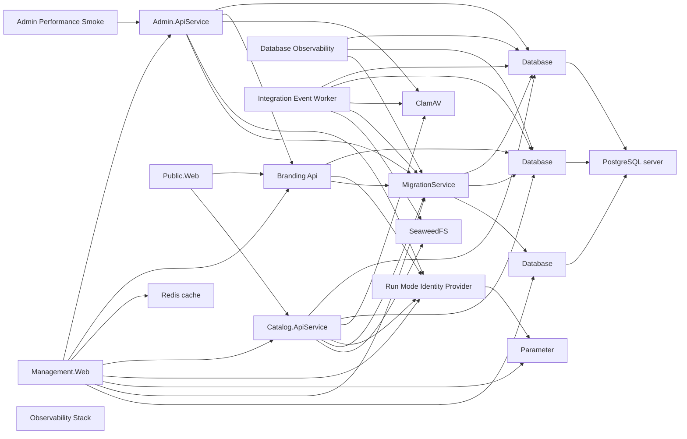

# Runtime wiring and deployment mapping

This page separates the current local Aspire model from deployment guidance and planned runtime
improvements. Secret values are intentionally omitted.

## Current local Aspire resource graph

`src/ViajantesTurismo.AppHost/AppHost.cs` selects the hosted profile; `AppHostComposition.cs` is the
source of truth for local runtime wiring.

<!-- generated:apphost-resources:start -->
<!-- Generated by tools/SharedKernel.Documentation.Tool. Do not edit by hand. -->

```mermaid
flowchart LR
    AdminPerformanceSmoke[Admin Performance Smoke]
    apiService[Admin.ApiService]
    brandingApiService[Branding Api]
    catalogApiService[Catalog.ApiService]
    clamAv[ClamAV]
    adminDatabase[Database]
    catalogDatabase[Database]
    securityDatabase[Database]
    DatabaseObservability[Database Observability]
    IntegrationEventWorker[Integration Event Worker]
    ManagementWeb[Management.Web]
    migrationService[MigrationService]
    ObservabilityStack[Observability Stack]
    managementWebClientSecret[Parameter]
    databaseServer[PostgreSQL server]
    PublicWeb[Public.Web]
    cache[Redis cache]
    identityProvider[Run Mode Identity Provider]
    seaweedFs[SeaweedFS]
    AdminPerformanceSmoke --> apiService
    DatabaseObservability --> adminDatabase
    DatabaseObservability --> catalogDatabase
    DatabaseObservability --> migrationService
    IntegrationEventWorker --> adminDatabase
    IntegrationEventWorker --> catalogDatabase
    IntegrationEventWorker --> clamAv
    IntegrationEventWorker --> migrationService
    IntegrationEventWorker --> seaweedFs
    ManagementWeb --> apiService
    ManagementWeb --> brandingApiService
    ManagementWeb --> cache
    ManagementWeb --> catalogApiService
    ManagementWeb --> identityProvider
    ManagementWeb --> managementWebClientSecret
    ManagementWeb --> migrationService
    ManagementWeb --> securityDatabase
    PublicWeb --> brandingApiService
    PublicWeb --> catalogApiService
    adminDatabase --> databaseServer
    apiService --> adminDatabase
    apiService --> brandingApiService
    apiService --> clamAv
    apiService --> identityProvider
    apiService --> migrationService
    brandingApiService --> catalogDatabase
    brandingApiService --> identityProvider
    brandingApiService --> migrationService
    catalogApiService --> adminDatabase
    catalogApiService --> catalogDatabase
    catalogApiService --> clamAv
    catalogApiService --> identityProvider
    catalogApiService --> migrationService
    catalogApiService --> seaweedFs
    catalogDatabase --> databaseServer
    identityProvider --> managementWebClientSecret
    migrationService --> adminDatabase
    migrationService --> catalogDatabase
    migrationService --> securityDatabase
    securityDatabase --> databaseServer
```
<!-- generated:apphost-resources:end -->

Current AppHost rules:

- Infrastructure resources are declared before services.
- Service-specific references and startup dependencies are shown in the generated graph above; do not
  maintain a second edge list here.
- `IntegrationEventWorker` reads Admin transport rows and writes Catalog idempotency/event-store state.
- API services stay internal; web frontends expose external HTTP endpoints.
- ClamAV stays private on TCP; Admin API, Catalog API, and Integration Event Worker receive its
  private host and port and wait for its PING/PONG health check.
- The performance smoke resource is opt-in through `VT_ASPIRE_ENABLE_PERFORMANCE_TESTS=1`.

## Reference rules

- Use `.WithReference(...)` for connection strings and service discovery injection.
- Do not copy generated connection strings or endpoint URLs into docs or settings files.
- Keep resource names centralized in `src/ViajantesTurismo.Resources/ResourceNames.cs`.
- Keep local-only ports in launch settings and AppHost configuration, not production docs.

## Production runtime configuration boundary

Production runtime options are documented in [Configuration Standards](../CONFIGURATION.md). The
current production-overridable option is
`CatalogIntegrationEvents:IdempotencyLockDuration`, with environment variable form
`CatalogIntegrationEvents__IdempotencyLockDuration`.

Deployment mapping:

| Source | Deployment target | Boundary |
| --- | --- | --- |
| Production runtime option | App setting or environment variable on the consuming service | Operator-facing. |
| Secret or credential | User secrets locally; managed secret store, deployment secret, or platform secret reference remotely | No sample values. |
| Connection string | Aspire resource reference or deployment secret/reference | Generated; do not hardcode. |
| Service endpoint | Aspire service discovery reference | Generated from `.WithReference(...)`. |
| Local AppHost setting | Local environment variable or launch profile value | Local unless promoted. |
| Existing cloud resource choice | Deployment parameter | Environment-owned infrastructure setting. |

## Database initialization service

Current behavior:

- `MigrationService` applies database migrations in every environment, atomically initializes the
  synthetic Admin data set only in Development, then exits.
- `DatabaseInitializationWorker.RunMigrations` calls `PostgreSqlEventSourcingSchema.Initialize` after
  the Catalog EF migration; the initializer is rerunnable and owns the Catalog event-store schema only.
- Admin, Catalog, Branding, and Management Security wait for `MigrationService` completion before starting.
- The Admin, Catalog, Branding, and Management Security infrastructure projects are referenced by the migration service.

Operational boundary:

- Migration state belongs to the database and migration service.
- Business rules for Development data initialization still belong in domain/application code.
- Deployment automation should preserve the startup ordering or provide an equivalent migration gate.

Admin and Catalog use separate PostgreSQL databases, even when both databases share one server. Each
database owns its own `messaging` schema. The Admin relay and transport queue remain in the Admin
database; Catalog inbox/idempotency and Catalog outbox state remain in the Catalog database.

## Local Aspire versus deployment guidance

Local Aspire:

- command: `dotnet tool run aspire run`
- source: `src/ViajantesTurismo.AppHost`
- purpose: local orchestration, service discovery, health checks, dashboard, and developer tools
- local tooling: PgWeb, RedisInsight, and optional k6 smoke resource

Deployment guidance:

- use the AppHost model as the resource relationship source
- use [Production readiness and operations](../operations/production-readiness.md) for promotion, smoke checks, runbooks, and rollback
- map production options from `docs/CONFIGURATION.md` to deployed services
- map secrets by boundary and owning platform, not by example values
- keep deployment-time infrastructure choices in deployment parameters
- avoid promoting local AppHost values unless operators need environment-specific control

### Local scanner and storage reset

ClamAV definitions persist in `clamav-definitions` at `/var/lib/clamav`; an isolated test run uses
`clamav-<suffix>-definitions`. Stop the AppHost first, inspect the exact volume with
`docker volume ls`, then remove only a verified volume with `docker volume rm <verified-volume-name>`
when a definitions reset is required. Removing it is destructive: cached signatures are deleted and
FreshClam downloads them again on the next start. Do not run `docker volume prune` for this purpose.

ClamAV remains private TCP-only. Its PING/PONG health check gates dependent services instead of a
fixed startup delay. The AppHost does not set a ClamAV memory limit; local container runtime capacity
must accommodate the daemon and loaded definitions.

## Application container publish boundary

Release workflows own version and registry values. The AppHost owns the resource graph, service
references, health checks, and local developer-tool wiring; it must not inspect Git tags, parse commit
history, or become the release-version source.

The release flow should calculate versions with `SharedKernel.Versioning.Tool calculate-release`, then
pass the computed `package_version` into `aspire publish` as configuration, environment variables, or
MSBuild properties. Application container resources can then use Aspire publish hooks such as
`PublishAsDockerFile(...)`, `WithImageTag(...)`, `WithImageRegistry(...)`, and
`WithImagePushOptions(...)`. Use `WithManifestPublishingCallback(...)` only when deployment metadata is
not already represented by Aspire resource annotations.

Release Prep passes the computed assembly, file, package, and informational versions to MSBuild during
`aspire publish`. The application assemblies therefore carry the same `InformationalVersion` that
SharedKernel observability emits through startup logs and the OpenTelemetry `service.version` resource
attribute. Source SHA stays in deployment metadata environment values instead of the image tag.

Infrastructure image tags and SHA-256 digests remain pinned independently from application release
versions.

## Planned improvements

- Add deployment-environment-specific docs when the target hosting platform is selected.
- Add production image policy docs when production container publishing is defined.
- Add automated checks for undocumented production options only after the current table remains stable.
