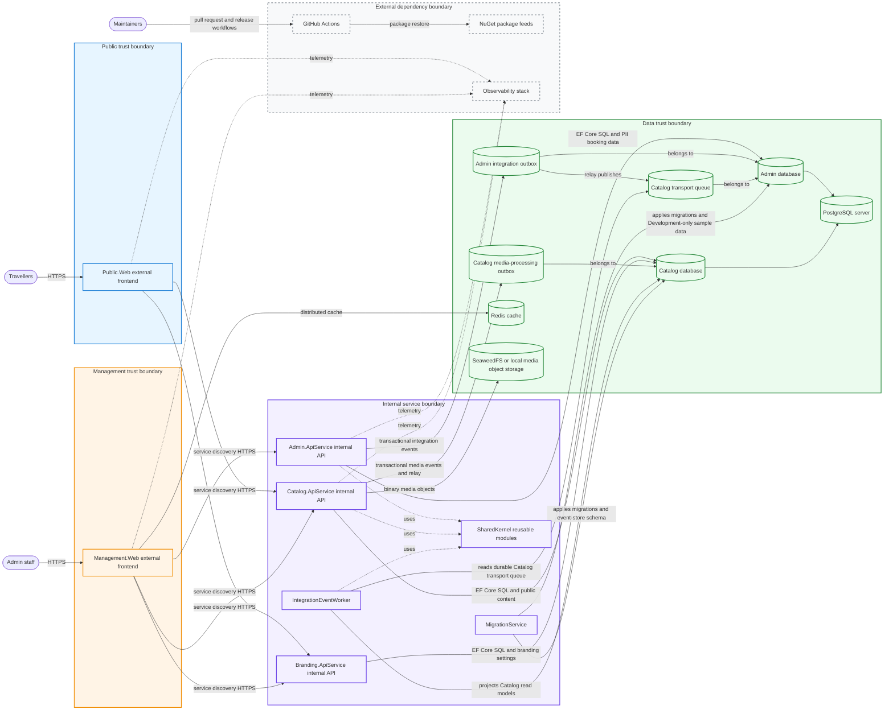

# System architecture diagram

This C4-style container map gives a single GitHub-rendered view of runtime entry points, internal
services, data stores, messaging tables, shared libraries, and supporting external dependencies. Edit
the Mermaid source in `docs/architecture/generated-diagrams.json`; the architecture diagram script
refreshes the generated Markdown block.

<!-- generated:system-overview:start -->
<!-- Generated by tools/SharedKernel.Documentation.Tool. Do not edit by hand. -->

<!-- generated:system-overview:end -->

## How to read the boundaries

- **Public trust boundary**: traveller-facing web entry point exposed through external HTTP.
- **Management trust boundary**: staff-facing management entry point exposed through external HTTP.
- **Internal service boundary**: APIs, worker, migration service, and reusable SharedKernel modules
  that stay behind service discovery.
- **Data trust boundary**: PostgreSQL databases, durable outbox/event tables, Redis cache, and the
  media storage adapter boundary.
- **External dependency boundary**: repository automation, package feeds, and observability tooling
  that support delivery or operations but do not own domain data.

High-level PII and booking data are owned by the Admin database. Public content, media metadata,
event store records, and projections are owned by the Catalog database. Detailed threat and privacy
findings belong in maintained security or threat-model docs rather than this overview.

## Generated detail links

- [Runtime wiring and deployment mapping](runtime-wiring-and-deployment.md) includes the generated
  AppHost resource graph and service-reference rules.
- [Architecture boundaries and dependency flow](boundaries-and-dependencies.md) includes generated
  project reference and SharedKernel dependency diagrams.
- [CI and local validation flow](ci-validation-flows.md) includes generated validation workflow
  diagrams.

## Refresh

Run `bash scripts/update-architecture-diagrams.sh` after changing generated diagram sources or
`docs/architecture/generated-diagrams.json`. The repository lint path checks generated diagram
freshness. See [Diagram guidance](diagram-guidance.md) for diagram type selection and generation
source policy.
