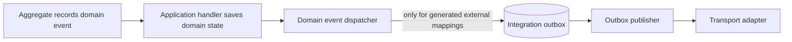

# Events and Messaging

This document defines the durable event and messaging direction for ViajantesTurismo.

## Principles

- Domain events and integration events are separate concepts.
- Domain events belong to DDD aggregate logic and stay inside one bounded context.
- Integration events are explicit cross-boundary contracts.
- Event dispatch stays in its owning module and uses generated typed dispatch instead of mediator composition.
- Event dispatch APIs must remain typed and compiler-safe.
- CloudEvents are transport envelopes for integration events, not domain model primitives.
- Inbox, outbox, idempotency, and projections are infrastructure/runtime concerns, not aggregate
  responsibilities.

## Ubiquitous Language

Use event language for facts and contracts. Use messaging language for delivery, runtime state, and
transport boundaries.

| Term | Meaning |
| --- | --- |
| `DomainEvent` | Business fact raised by an aggregate inside one bounded context. |
| `IntegrationEvent` | Explicit, versioned, cross-boundary event contract. |
| `EventEnvelope` | Serialized event identity, type, time, source, content type, payload, and metadata. |
| `Message` | Delivery or processing unit carrying an envelope through a runtime boundary. |
| `OutboxMessage` | Durable outbound message with an envelope and publish state. |
| `InboxMessage` | Durable inbound message with an envelope and processing or de-duplication state. |
| `IdempotencyEntry` | Generic operation ledger keyed by scope and key. |
| `CloudEvent` | Standards-based event envelope used at interoperability boundaries. |

An integration event is the typed contract. A CloudEvent is an envelope. An outbox row is a durable
message record. These concepts should not be represented by one catch-all type.

## SharedKernel Modules

### `SharedKernel.Domain`

Owns DDD primitives:

- `IEntity<TId>`.
- `IAggregateRoot`.
- `IAggregateRoot<TId>`.
- `IDomainEvent`.
- Domain event recording and dequeueing.
- `IDomainEventDispatcher`, `IDomainEventDispatchHandler`, and `CompositeDomainEventDispatcher`.
- Generated typed outbox and audit dispatch composition.

### `SharedKernel.BuildingBlocks`

Owns reusable identity interfaces, value objects, and small cross-context primitives:

- `IIdentified<TId>`.
- `ValueObject`.
- `DateRange`.
- Future source-generated value-object conventions.

`SharedKernel.Domain.EntityFrameworkCore` owns the SaveChanges interceptor used before the owning
transaction commits. The integration-event source generator owns exhaustive domain-event-to-outbox
mapping calls. The mediator generator does not discover domain event handlers or register a competing
dispatcher.

### `SharedKernel.Messaging.IntegrationEvents`

Owns typed integration event contracts and transport boundaries:

- `IIntegrationEvent`.
- `IIntegrationEventHandler<TIntegrationEvent>`.
- `IIntegrationEventSerializer` and `IEventEnvelopePublisher` boundaries.
- Event type and version conventions.

The integration-event generator emits closed, typed serialization, deserialization, envelope delivery,
and domain-event mapping cases for each host compilation. It does not emit runtime registries,
reflection, or ordinary-flow service-provider lookup.

### `SharedKernel.Messaging.IntegrationEvents.CloudEvents`

Owns the current CloudEvents mapping adapter:

- Typed integration event to CloudEvents mapping.
- CloudEvents to typed integration event mapping.
- CloudEvents source, subject, type, and content-type conventions.

Bounded-context domain and application projects should not depend directly on this adapter.

Use `SharedKernel.Messaging.CloudEvents` only if a future storage-neutral `EventEnvelope` adapter is
needed. Keep `SharedKernel.Messaging.IntegrationEvents` focused on typed integration-event contracts and
dispatch.

### `SharedKernel.Messaging`

Storage-neutral messaging abstractions that are not specific to domain events,
integration events, or event sourcing:

- `EventEnvelope` concepts.
- Message identity and metadata conventions.
- Shared envelope validation.
- Runtime-neutral outbox and inbox contracts, if needed.

Provider-specific persistence remains outside this module. EF Core messaging providers live in
`SharedKernel.Messaging.IntegrationEvents.EntityFrameworkCore`,
`SharedKernel.Idempotency.EntityFrameworkCore`, and `SharedKernel.Domain.EntityFrameworkCore`.

### `SharedKernel.Idempotency`

Owns idempotency abstractions:

- `IdempotencyKey`.
- `IdempotencyScope`.
- `IIdempotencyStore`.
- Processed operation or message identity.

Idempotency applies to integration inbox processing, command/request handling, projection
checkpointing, and future endpoint runtime flows. Persistence belongs in infrastructure or adapter
projects.

### `SharedKernel.EventSourcing`

Owns event-sourcing abstractions:

- `EventSourcedAggregateRoot<TId>`.
- `IEventStore`.
- `IEventSerializer`.
- `StreamId`.
- `StreamVersion`.
- `EventSequence`.
- `IProjection`.
- `IProjectionCheckpointStore`.

Event-sourcing infrastructure may use PostgreSQL first, but the SharedKernel abstractions should
remain storage-neutral.

### Provider Modules

Provider-specific reusable infrastructure belongs in `SharedKernel.<Capability>.<Provider>` modules.
For example, `SharedKernel.EventSourcing.Npgsql` contains PostgreSQL event-store and projection
checkpoint persistence, while `SharedKernel.EventSourcing` remains storage-neutral.

Bounded-context infrastructure owns composition, schema naming, migrations, read models, and
context-specific operational policy. Generated and runtime ownership is explicit:

| Capability | Owner | Registration and lifetime |
| --- | --- | --- |
| Request, stream, and notification dispatch | `SharedKernel.Mediator.SourceGenerator` | `AppMediator` is scoped; closed `Func<T>` dependencies resolve scoped handlers lazily, preserve pipeline order, and avoid a general runtime registry. |
| Domain event handling and transactional outbox mapping | Domain-event provider generators | A scoped `CompositeDomainEventDispatcher` invokes generated typed handlers for outbox and audit mappings. |
| Integration-event serialization | `SharedKernel.Messaging.IntegrationEvents.SourceGenerator` | `IIntegrationEventSerializer` is singleton and receives closed `JsonTypeInfo<T>` dependencies. |
| Background envelope delivery | `SharedKernel.Messaging.IntegrationEvents.SourceGenerator` | One consumer scope owns each claimed batch; its generated `IEventEnvelopePublisher` and typed handlers process messages sequentially. |
| Outbox persistence and relay | `SharedKernel.Messaging.IntegrationEvents.EntityFrameworkCore` | Context configuration and outbox services are explicit; relay/retry remains infrastructure-owned. |
| Inbox idempotency | `SharedKernel.Idempotency.EntityFrameworkCore` | Owns `EfIdempotencyStore<TContext>` and its model configuration. `SharedKernel.Messaging.IntegrationEvents.EntityFrameworkCore` exposes `AddIntegrationEventInbox<TContext>()` as the integration-event composition call; inbox registration is not implied by outbox registration. |

See
[ADR-027](../adr/20260624-provider-specific-sharedkernel-infrastructure-modules.md) for naming and
boundary rules.

Generated code owns closed mechanical dispatch only; business behavior, persistence transactions,
leases, retries, idempotency, and authorization remain in their runtime owners. Dynamic registries are
not part of the generated path.

| Boundary | Runtime entry | Generated responsibility | Runtime/business responsibility |
| --- | --- | --- | --- |
| Admin use case | Endpoint to directly resolved scoped handler | None | Handler orchestration, validation, authorization, aggregate behavior, and `SaveEntities(ct)`. |
| Regular mediator use case | Caller to scoped `AppMediator` | Closed request/stream/notification and pipeline calls | Handler business behavior and configured pipeline semantics. |
| Admin persistence | `SaveChanges` interceptor to composite domain-event dispatcher | Exhaustive typed outbox and audit mappings plus typed serialization | EF transaction, aggregate state, outbox/audit atomicity, and post-save domain-event clearing. |
| Durable delivery | Admin relay to PostgreSQL transport to worker batch to generated publisher | Closed envelope deserialization and typed handler selection | `FOR UPDATE SKIP LOCKED`, batch scope, sequential processing, lease/retry, Catalog idempotency, and handler side effects. |

## Domain Events

Domain events describe business facts inside one bounded context. Aggregates raise them as part of
state transitions.

Domain events should:

- Be raised by aggregate behavior.
- Be meaningful within one bounded context.
- Avoid transport, serialization, and CloudEvents concerns.
- Be dispatched after successful domain work according to the owning application policy.
- Not automatically publish integration events.

Example shape:

```csharp
public interface IDomainEvent;

public interface IDomainEventDispatcher
{
    ValueTask Dispatch<TDomainEvent>(TDomainEvent domainEvent, CancellationToken ct)
        where TDomainEvent : IDomainEvent;
}

```

## Integration Events

Integration events are explicit contracts between bounded contexts or external systems.

Integration events should:

- Be saved intentionally from domain event dispatch when a domain event needs cross-boundary
  notification.
- Be versioned and named with stable event type identifiers.
- Avoid referencing domain entity types.
- Be persisted through outbox when they must be reliably published with local state changes.
- Be processed through inbox when consumed from another boundary.

Not every domain event produces an integration event. Domain event handlers can perform in-process work,
call local application dependencies, update local read models, or do nothing externally. When an
integration event is required, the domain event dispatch path is the only place that should create and
save that integration event. Controllers, API endpoints, command handlers, and background jobs should not
publish or persist integration events directly.

This keeps outbound contracts tied to committed domain facts while avoiding accidental external messages
for domain events that are purely local.

When integration events are persisted through an EF Core outbox, aggregate rows and outbox rows must be
saved in the same `SaveChanges` transaction. Domain events should be cleared only after save success;
after a failed save, discard the DbContext and retry with a fresh unit of work rather than retrying the
same tracked entities and already-added outbox rows.



Example shape:

```csharp
public interface IIntegrationEvent;

public interface IIntegrationEventHandler<in TIntegrationEvent>
    where TIntegrationEvent : IIntegrationEvent
{
    ValueTask Handle(TIntegrationEvent integrationEvent, CancellationToken ct);
}
```

## CloudEvents

CloudEvents are used at integration boundaries.

Recommended fields:

- `id`: integration event id, preferably Guid v7.
- `source`: bounded context or service, such as `ViajantesTurismo.Admin`.
- `type`: stable event type, such as `viajantesturismo.admin.tour.created.v1`.
- `subject`: aggregate or resource id.
- `time`: occurrence timestamp.
- `datacontenttype`: `application/json`.
- `dataschema`: optional schema URI when schema publication exists.

The typed event remains the code contract. CloudEvents is an adapter/envelope standard for
transport and interoperability.

## Inbox and Outbox

Inbox and outbox tables are part of the architecture.

### Outbox

Use an outbox when a bounded context publishes integration events as part of a state change.

Purpose:

- Persist integration events in the same transaction as local state changes.
- Dispatch later through a background dispatcher.
- Avoid event loss after database commit and before transport publish.

Runtime shape:

- Core contracts live in SharedKernel abstractions.
- Storage-neutral integration-event contracts live in `SharedKernel.Messaging.IntegrationEvents`.
- EF Core outbox provider code lives in `SharedKernel.Messaging.IntegrationEvents.EntityFrameworkCore`.
- EF Core idempotency provider code lives in `SharedKernel.Idempotency.EntityFrameworkCore`.
- EF outbox messages default to `messaging.outbox_messages`.
- `AddIntegrationEventOutbox<TContext>()` registers only the EF outbox and its default model
  configuration. Its storage overload accepts `IntegrationEventStorageOptions` for a context-owned
  schema, outbox table, and transport table.
- `SharedKernel.Messaging.IntegrationEvents.EntityFrameworkCore` exposes
  `AddIntegrationEventInbox<TContext>()`; it delegates to the
  `SharedKernel.Idempotency.EntityFrameworkCore` provider and registers only the shared idempotency
  store and inbox table model configuration. Its storage overload accepts
  `IdempotencyStorageOptions`.
- Admin supplies AOT-safe `JsonTypeInfo<T>` metadata; generated composition registers the closed
  `IIntegrationEventSerializer` before the EF outbox resolves it.
- Provider models and EF migrations are authoritative for envelope, payload, publication, retry/error,
  and claim fields; do not duplicate their volatile column inventory here.
- Admin runtime registers the PostgreSQL transport producer and outbox relay. Relayed Admin events enter
  the durable Catalog transport queue claimed by `IntegrationEventWorker`.
- Catalog API runs its own outbox relay for Catalog-originated media processing events and dispatches
  them to registered in-process handlers.
- The [generated event/message flow map](../architecture/generated-event-message-flow-map.md) is the
  source-derived contract, mapping, registration, and handler inventory.

### Context-qualified EF composition

The no-argument registrations retain `messaging.outbox_messages`,
`messaging.transport_messages`, and `messaging.idempotency_keys`, so an existing single-context
application has no model or migration drift. Co-hosted contexts must give each migration-owned table
a distinct schema/table pair:

```csharp
services.AddIntegrationEventOutbox<ModuleDbContext>(storage =>
{
    storage.Schema = "module_messaging";
    storage.OutboxTableName = "outbox_messages";
    storage.TransportTableName = "transport_messages";
});
services.AddIntegrationEventInbox<ModuleDbContext>(storage =>
{
    storage.Schema = "module_messaging";
    storage.TableName = "idempotency_keys";
});
services.AddPostgreSqlIntegrationEventTransportProducer<ModuleDbContext>("downstream");
services.AddIntegrationEventOutboxRelay<ModuleDbContext>();
```

For a transport-consumer-only context, call
`ConfigureIntegrationEventStorage<TContext>(...)` before
`AddPostgreSqlIntegrationEventTransportConsumer<TContext>(...)`.

`IIntegrationEventOutbox`, `IIdempotencyStore`, and transport producers are keyed by
`typeof(TContext)`. Resolve outbox/idempotency keys when more than one context is registered; their
first registration remains available unkeyed for single-context compatibility. Transport producers
are available only as keyed `IEventEnvelopePublisher` services and must always be resolved by their
context key; producer registration never occupies the unkeyed publisher service. A relay first resolves
its exact context key, then falls back to the required unkeyed application publisher. A transport
consumer always requires the unkeyed application or generated publisher.

Each physical table must have one migrations owner. A context that only reads a shared transport table
may map it for runtime consumption, but its migrations must not create that producer-owned table.
Changing a default mapping is an application migration: scaffold and review the owning context's table
move/rename instead of letting two migration histories create the same table.

### Inbox

Use an inbox when a bounded context consumes integration events from outside its transaction
boundary.

Purpose:

- Deduplicate at-least-once message delivery.
- Store receive and processing status.
- Support retries and diagnostics.

Consumers should use CloudEvents `source` plus `id` or the equivalent typed integration event identity as
the idempotency key. Handler side effects must also be idempotent: use deterministic object keys,
database unique constraints, and upsert-or-skip behavior for externally visible outputs. The inbox guards
message handling, but the handler still owns safe replay behavior if work partially completed before a
retry.

Runtime shape:

- Core idempotency contracts live in `SharedKernel.Idempotency`.
- EF Core provider code lives in `SharedKernel.Idempotency.EntityFrameworkCore`.
- Durable idempotency entries default to `messaging.idempotency_keys`.
- `AddIntegrationEventInbox<TContext>()` is the integration-event adapter's app-facing startup call for
  consumers that need inbox idempotency. `SharedKernel.Idempotency.EntityFrameworkCore` owns the store,
  entity, and model configuration used by that call.
- Catalog consumes Admin tour-created events through `IdempotentIntegrationHandler<TIntegrationEvent>`
  when the handler is resolved from DI.
- The idempotency row moves from `Started` to `Completed` after the inner handler succeeds. If the
  process fails before completion, a later delivery can restart after the configured lock duration.
- The PostgreSQL consumer claims rows with `FOR UPDATE SKIP LOCKED`, lease, and retry metadata. One DI
  scope owns the claimed batch; messages are delivered sequentially through the generated publisher.
  The runtime does not claim per-envelope parallelism.

Recommended columns:

- `message_id`.
- `event_type`.
- `event_version`.
- `source`.
- `subject`.
- `received_at_utc`.
- `processed_at_utc`.
- `status`.
- `attempt_count`.
- `last_error`.
- `payload_hash`.
- `correlation_id`.
- `causation_id`.

## Event Sourcing

Event-sourced aggregates persist state transitions as append-only event streams.

Event-sourced flows should include:

- Stream identity.
- Expected stream version for optimistic concurrency.
- Ordered event sequence numbers.
- Event metadata.
- Projection checkpoints.
- Replay and rebuild paths for read models.

Catalog tours use event sourcing because customer-facing content needs clear versioning, auditability,
and rebuildable projections.

## Runtime Direction

Keep runtime capabilities independently composable:

- Minimal API endpoint registration.
- Mediator command/query handlers.
- Generated domain-event-to-outbox mappings.
- Integration event subscriptions.
- Event-sourced projections.
- Health checks and diagnostics.
- OpenAPI metadata.

Transport adapters should remain replaceable:

- Generated in-process mediator.
- PostgreSQL inbox/outbox.
- CloudEvents HTTP.
- Dapr pub/sub.
- MassTransit.
- Future gRPC.

## Related Documentation

- [ADR-022: Split SharedKernel Domain and Building Blocks](../adr/20260621-split-sharedkernel-domain-and-building-blocks.md)
- [ADR-023: Separate Domain and Integration Event Dispatch](../adr/20260621-separate-domain-and-integration-event-dispatch.md)
- [ADR-024: CloudEvents as Integration Event Adapter](../adr/20260621-cloudevents-as-integration-event-adapter.md)
- [ADR-025: Event Source Catalog Tour Presentation](../adr/20260621-event-source-catalog-tour-presentation.md)
- [Catalog Bounded Context](../bounded-contexts/Catalog.md)
- [Generated messaging dispatch ownership](../adr/20260719-generated-messaging-dispatch-ownership.md)
- [SharedKernel packaging and source-generator contracts](../SHAREDKERNEL_PACKAGING.md)
