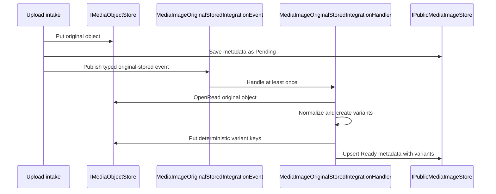
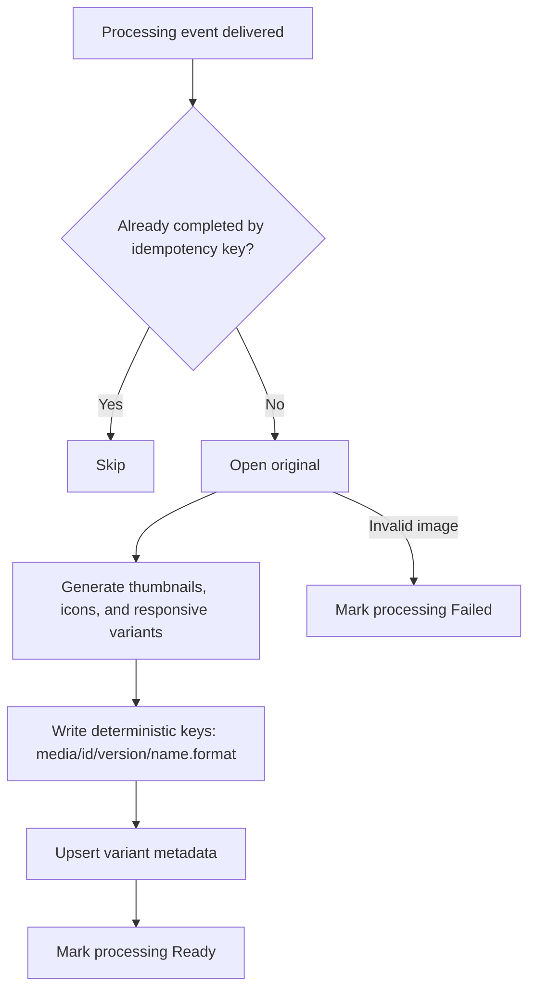

# Media image processing flow

This page documents the Catalog media processing flow.

## Current implemented flow

## Retry and idempotency model

The typed event id is the idempotency key for inbox-style consumers. Variant object keys use the
media id, processing version, variant name, and format so replay overwrites the same objects instead
of appending duplicate variants.

CloudEvents remains a transport envelope only; the application contract is the typed integration
event.
